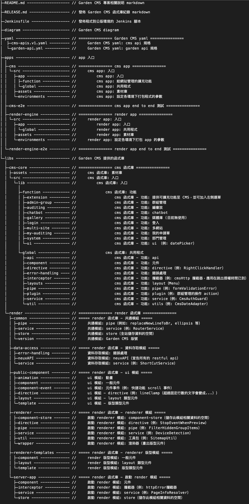
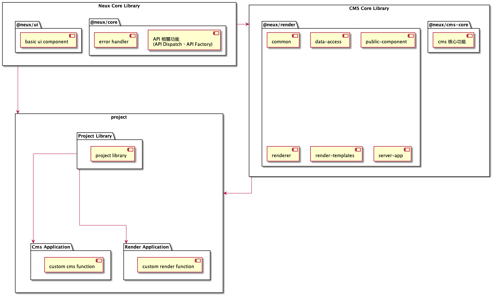

# 目錄結構、各模組範圍及依賴關係

[1. 目錄結構、各模組範圍](#1-目錄結構各模組範圍)

[2. 依賴關係](#2-依賴關係)

---

## 1. 目錄結構、各模組範圍

   
      
【圖片】目錄結構、各模組範圍

 

## 2. 依賴關係

   
      
【圖片】依賴關係

 

<link rel="stylesheet" type="text/css" href="./style/style.css" />

    <a href="#目錄結構各模組範圍及依賴關係" class="back-to-top-link" aria-label="Scroll to Top">↑</a>

