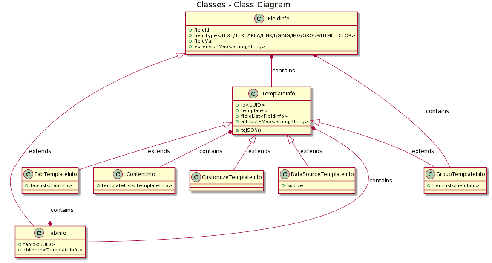
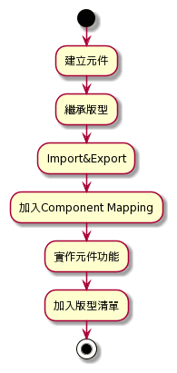
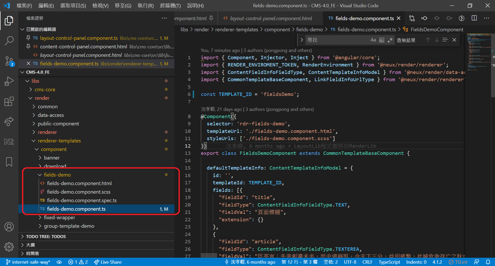
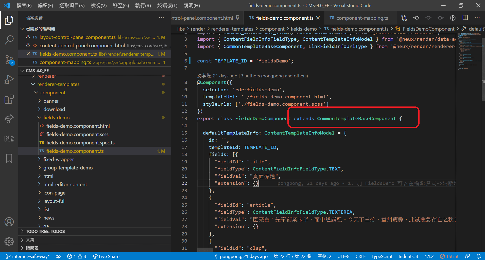
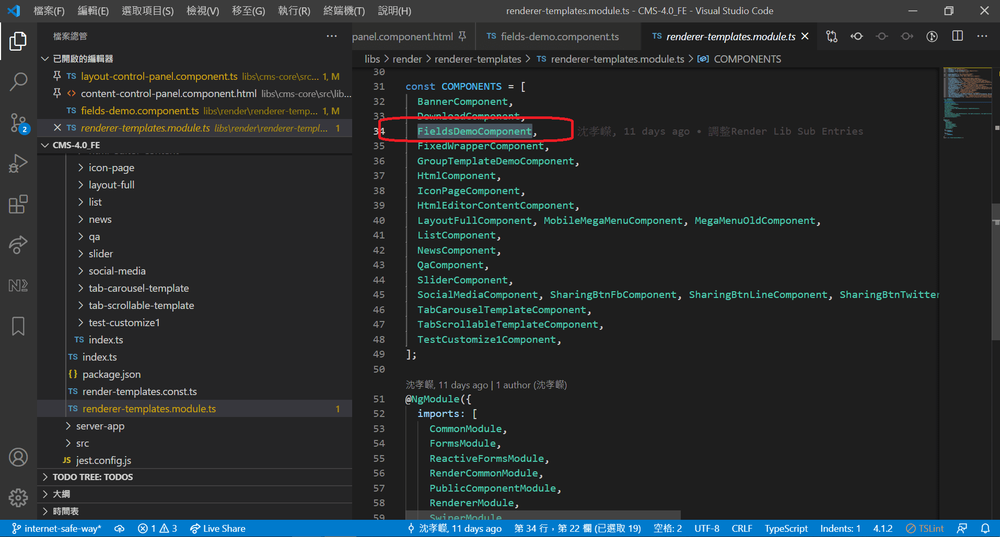
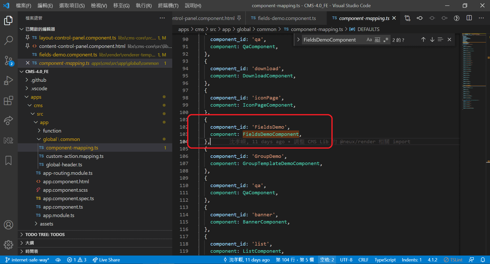
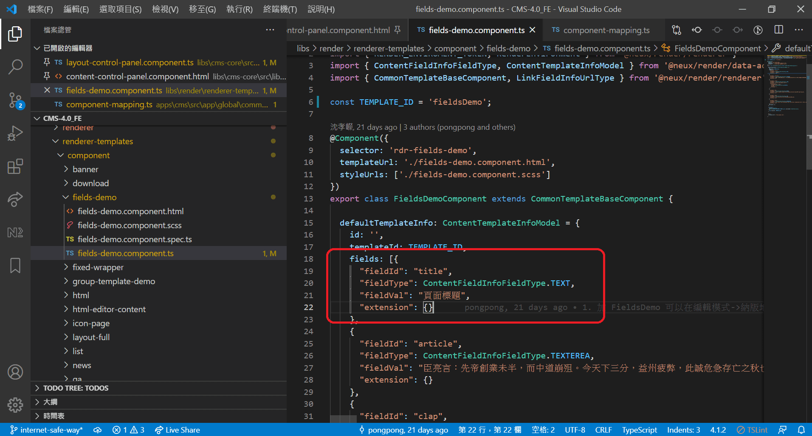
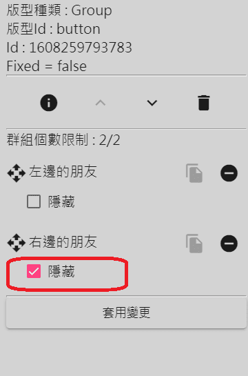

<!-- 
<link rel="stylesheet" type="text/css" href="./style/style.css" />

<div class="back-to-top-wrapper">
    <a href="#header_wrap" class="back-to-top-link" aria-label="Scroll to Top">
↑</a>
</div> -->

* TOC
{:toc}

---

# 開發規範-納版
{: .no_toc}

## 1. 納版定義
* 根據網頁畫面元件之處理程序，版型(註[^1])分成兩個種類，第一種為納入版型:納版(註[^2])，第二種為套入版型:套版(註[^3])，將版型納入CMS(註[^4])編輯器中供使用者編輯網頁畫面。


## 2. 資料格式
  

## 3. 版型分類

### 3.1 Common 

- 單純由 “固定的” 輸入欄位( Field )構成
- 資料格式

    ```typescript
        class ContentTemplateInfoModel {
            id: string; // uuid
            templateId: string; // 對應版型元件的版型 id
            fields: FieldInfo[]; // 欄位資料集合，資料格式參考 "輸入欄位種類" 部分
            attributes: { [key:string]: string }; // 擴充資料，用來存其他設定
        }
    ```

### 3.2 Tab

- 固定的輸入欄位 : 有或無皆可
- 具有可定義最大數量的頁籤
- 每個頁籤的內容可有複數版型
- 資料格式
  ```typescript
        class TabTemplateInfo extends TemplateInfo {
            tabList: TabInfo[]; // Tab 資料
        }
        
        class TabInfo {
            tabId: string; // uuid
            children: TemplateInfo[]; // Tab 內容中的複數版型
            attributes: {
              maxItemCounts: 8, // - 輸入欄位群組中，值會用來作為群組顯示名稱的欄位id
              maxTotalTitlesLength: 1000, // - 所有 tab 最大標題長度
            },
        }
  ```

### 3.3 Group
- 固定的輸入欄位 : 有或無皆可
- 具有可定義最大數量的輸入欄位群組
- 每個群組中會有相同的複數輸入欄位
- 同一欄位群組中，不同欄位的 應該不同
- 不同欄位群組中，相同角色欄位的 命名應該相同
- 資料格式

```typescript
        class GroupTemplateInfo extends TemplateInfo {
            itemList: FieldInfo[][]; // 欄位資料集合群組  
            attributes: {
              maxItemCounts: 4,  // - 輸入欄位群組中，值會用來作為群組顯示名稱的欄位id
              itemDisplayFieldId: 'title',  // - 如果是空值的話，會用當前順序(數字)作為顯示
            }     
        }
```
### 3.4 DataSource
- 固定的輸入欄位 : 有或無皆可
- 可選擇資料來源
- 資料格式
  ```typescript
        class DataSourceTemplateInfo extends TemplateInfo {
            source; // 所選資料來源選項的值
        }
  ```
### 3.5 Customize
 - 作為擴充性的保留，目前無使用
 - 資料格式
      ```typescript
        class CustomizeTemplateInfo extends TemplateInfo {

        }
      ```
## 4.輸入欄位種類
### 4.1 <font color="red">資料格式</font>
  ```typescript
      class FieldInfo {
        fieldId: string; // 用來在欄位集合中辨識欄位的 id
        fieldType: FieldType; // 欄位類型
        fieldVal: any; // 欄位值
        extension: { [key: string]: string }; // 擴充資料，by Type會有不同 <K, V>
      }

      enum FieldType {
       TEXT = 'TEXT',
       TEXTEREA = 'TEXTEREA',
       LINK = 'LINK',
       BGIMG = 'BGIMG',
       IMG = 'IMG',
       HTMLEDITOR = 'HTMLEDITOR'
     };
  ```
### 4.2 <font color="red">類型</font>
#### 4.2.1 TEXT
 - 短文字
 - 版型可定義
 - 最大字元數
 - extension
    ```typescript
        extension: {

        }
    ```
#### 4.2.2 TEXTAREA
 - 文字區塊，可換行
 - 版型可定義
 - 最大字元數
 - 最大行數
 - extension
    ```typescript
        extension: {

        }
     ```
#### 4.2.3 LINK
- 連結
- extension
     ```typescript
        extension: {
            isTargetBlank: 'true' | 'false' = 'false'; // 是否另開分頁開啟，預設'false'
        }
     ```
#### 4.2.4 BGIMG
- 背景圖片
- 版型可定義
  - 建議寬度
  - 建議高度
  - 建議格式
- extension
    ```typescript
        extension: {

        }
    ```
#### 4.2.5 IMG
 - 圖片
 - 版型可定義
   - 建議寬度
   - 建議高度
   - 建議格式
  - extension
      ```typescript
        extension: {
            altValue: string = ''; // 圖片描述，用在  的 alt 屬性，預設空字串
        }
     ```
#### 4.2.6 HTMLEDITOR
 - HTML編輯器
 - extension
    ```typescript
        extension: {

        }
    ```
## 5. 實作版型

### 5.1 <font color="red">說明</font>
- 根據版型元件種類，從 Layout 模組 import 對應的 BaseClass 並繼承
- 繼承時需要在 constructor 帶入 templateId 參數，必須不與其他版型重複，通常後端會給，沒有的話詢問或定義後告訴後端
- 實作繼承的 BaseClass 所宣告的 abstract 屬性或方法
- 根據版型元件種類，在 html 中使用特定 Component 或 Directive 並帶入參數

### 5.2 <font color="red">BaseClass 的 Member</font>
#### 5.2.1 Property
  ```typescript
    TEMPLATE_ID: string, readonly
        - readonly
        - 繼承 base 元件時傳入的 templateId，不與其他版型重複
        - 小駝峰命名法則
    
    TemplateType: enum<string>
        - 版型種類列舉
        - Common/Tab/DataSource/Group/Customize
        - 可在 html 中直接使用
        
    FieldType: enum<string>
        - 欄位類型列舉
        - TEXT/TEXTEREA/LINK/BGIMG/IMG/HTMLEDITOR
        - 可在 html 中直接使用
        
    templateInfo: TemplateInfo
        - 版型資料
        
    templateType: TemplateType
        - 元件的版型種類(特定)
        - 小駝峰命名法則
        
    defaultTemplateInfo: ContentTemplateInfoModel
        - 從編輯器選擇版型加入時的預設資料
        
    mode: 'isEditor' | 'isPreview' | 'isRuntime'
        - 模式，可用來設計不同行為
        
    destroy$: Subject<any>
        - 元件 OnDestroy 
        
    其他
        - for 編輯器和渲染器用，一般來說版型元件中不太需要使用
  ```
#### 5.2.2 Method
  ```typescript
    ngOnInit(): void
        - 版型元件內如果要自行實作此方法，記得第一行呼叫super.ngOnInit()
        
    ngOnChanges(changes: SimpleChanges): void
        - 版型元件內如果要自行實作此方法，記得第一行呼叫super.ngOnChanges(changes)
        
    ngAfterViewInit(): void
        - 版型元件內如果要自行實作此方法，記得第一行呼叫super.ngAfterViewInit()
    
    ngOnDestroy(): void
        - 版型元件內如果要自行實作此方法，記得第一行呼叫super.ngOnDestroy()
        
    getFieldByFieldId(fieldId:string, fields?: FieldInfo[]): FieldInfo
        - 在欄位資料群組中，根據 fieldId 找出第一個符合的欄位資料
        - fieldId
            - string
            - 欄位Id
        - fields
            - FieldInfo[]
            - 欄位群組，不給的話從 this.templateInfo.fields 找
            - 通常是 Group 類型的版型元件需要帶，因為有欄位群組
  ```
### 5.3 <font color="red">繼承與實作</font>
#### 5.3.1 <font color="blue">重要</font>
- 所有繼承的子元件，務必要實作自己的 constructor()，否則 aot 編譯時會有以下錯誤 : This constructor is not compatible with Angular Dependency Injection.
- constructor 內 super() 時務必傳有值的 templateId
- 所有繼承的子元件，如果子元件版型可以從 CMS 編輯器選擇並加入，務必要實作 <font color="red">defaultTemplateInfo</font> 屬性並且要給預設值，否則從編輯器加入版型時會因為沒有預設資料而錯誤。
#### 5.3.2 Common
- 繼承 CommonTemplateBaseComponent
#### 5.3.3 Tab
- 繼承 TabTemplateBaseComponent
- 在 html 中安排給內容選擇版型的地方，放入 TemplatesContainerComponent
 ``` html
        <div class="tab-info-children-container">
            <templates-container [templates]="tabInfo.children"></templates-container>
        </div>   
  ```
#### 5.3.4 Group
- 繼承 GroupTemplateBaseComponent
- 實作 abstract 的屬性或方法
  ```typescript
        maxItemCount: number
            - 最多可設定的輸入欄位群組數量
            - 需 >= 1，否則預設為 1
  ```
#### 5.3.5 DataSource
- 繼承 DataSourceTemplateBaseComponent<font color="red"><T資料來源型別></font>
- 繼承後會有 (readonly)<font color="red">TYPE_ID</font>:string 屬性
    - 用來取得
        - 資料來源
        - 編輯時可接取的 "操作" 項目
    - 須由 當前元件 帶入 super() 
- 繼承後會有 (readonly)<font color="red">keyword</font>:string 屬性
    - 查詢資料時會帶為參數
    - 可對其賦值或取值
        
- 繼承後實作 <font color="red">defaultTemplateInfo</font> 屬性時
   - 宣告為 <font color="red">DataSourceTemplateInfo</font> 類型，資料屬性會有 source 欄位。
- 繼承後有 sourceData 屬性
  - 型別是 Array<T資料來源型別>，初始值是空陣列
  - 可在 Template(.html) 上直接使用 sourceData 來建立資料顯示的區塊。
- 繼承後有 getSourceData(): Observable<T資料來源型別[]> 方法
   - <font color="red">編輯器的編輯模式中不會呼叫此方法取得來源資料項目, 因為編輯模式中無法接取真實資料, 所以固定顯示套完資料後的示意圖</font>
- 由於 mode 可能為 編輯中或預覽，因此<font color="red">版型元件需要自行在 Template 用 *ngIf="(renderPageState$|async).isEditor"，來定義編輯和預覽時顯示的內容。</font>
    
#### 5.3.6 Customize
  - 繼承 CustomizeTemplateBaseComponent</font>
  - 繼承後會有 (readonly)<font color="red">TYPE_ID</font>:string 屬性
    - 用來取得編輯時可接取的 "操作" 項目


## 6. 實作輸入欄位

### 6.1 <font color="red">說明</font>

- 在欄位所在的元素中掛上 by 欄位類型的 FieldDirective 並帶入欄位資料，特定欄位需要帶入其他參數
- 取得輸入欄位資料
    - 可用 Pipe : getFieldFromFieldsById
        - 用法 : 
         ```html
            [對應Directive]="fields | getFieldFromFieldsById : 'field-id'"
         ```
        - 原因 : 減少效能負擔． fields 物件參考變更時才會呼叫 pipe function 取得結果，綁定 method 的話每次變更偵測都會 call function
- 在掛上 FieldDirective 的元素中，使用 #範本參考變數 取得 Directive 輸出的物件實體
    - 取得方式為 : #變數名稱="field" <-- field 為固定
    - 注意範本參考變數的 Scope 以及命名
- Directive 輸出的物件實體，屬性包含
    - fieldInfo: FieldInfo
        - 欄位資料
    - 通過 @input() 輸入的特定值(參考下面各類型範例)，一般不太會用到 
- 因此可用 #範本參考變數.fieldInfo.fieldVal 取得欄位資料的值
    - 注意 fieldInfo 是被 @Input() 輸入，因此還未輸入時可能是 undefined
    - 可用 fieldInfo<font color="red">?</font>.[屬性名稱] 的方式避免錯誤

### 6.2 <font color="red">範例</font>
#### 6.2.1 TEXT
範本
  ```html
      <div [libLayoutFieldText]="templateInfo?.fields | getFieldFromFieldsById:'field-id'"
         #fieldText="field" [maxLength]="16">
       <h1>{{ fieldText.fieldInfo?.fieldVal }}</h1>
       </div>
  ```
  @Input
  ```typescript
    libLayoutFieldText: FieldInfo
        - 欄位資料
        - 可使用 Pipe : [libLayoutFieldText]="fields | getFieldFromFieldsById : 'field-id'"
        
    maxLength: number
        - 長度限制
        - <= 0 表無限制
  ```
#### 6.2.2 TEXTAREA
 範本
  ```html
    <div [libLayoutFieldTextarea]="templateInfo?.fields | getFieldFromFieldsById:'field-id'"
        #fieldTextarea="field"
        [maxLength]="-1" [maxLines]="5
        [innerHTML]="fieldTextarea.fieldInfo?.fieldVal | newLineReplace | safeHtml">
    </div>
  ```
 @Input
   ```typescript
      libLayoutFieldTextarea: FieldInfo
        - 欄位資料
        - 可使用 Pipe : [libLayoutFieldTextarea]="fields | getFieldFromFieldsById : 'field-id'"
    
      maxLength: number
        - 長度限制
        - <= 0 表無限制
    
      maxLines: number 
        - 行數限制
        - <= 0 表無限制
    
      innerHTML: string
        - 內文 : FieldInfo.fieldVal 
        - 需與 Pipe 並用
            - newLineReplace : 將 "換行符號" 轉換為 "<br>" 呈現換行效果
            - safeHtml : 轉為 Angular 容許的安全 Html 內容
```

#### 6.2.3 LINK
範本
 ```html
    <div [libLayoutFieldLink]="fields | getFieldFromFieldsById:'field-id'"
        #fieldLink="field">
        <a [href]="fieldLink.fieldInfo?.fieldVal"
          [target]="fieldLink.fieldInfo?.extension?.isTargetBlank==='true'?'_blank':''">
          我是連結
        </a>
    </div>
 ```
@Input
 ```typescript
    libLayoutFieldLink: FieldInfo
        - 欄位資料
        - 可使用 Pipe : [libLayoutFieldLink]="fields | getFieldFromFieldsById : 'field-id'"
  ```
#### 6.2.4 BGIMG
範本
 ```html
    <div [libLayoutFieldBgimg]="templateInfo?.fields | getFieldFromFieldsById:'field-id'"
        #fieldBgimg="field"
        [adviceWidth]="500" [adviceHeight]="300" adviceFormat="bmp"
        [style.background]="'url(' + fieldBgimg.fieldInfo?.fieldVal + ')'">
        {{ 自訂內容(文字或子元素) }}
    </div>
 ```
 @Input
 ```typescript
    libLayoutFieldBgimg: FieldInfo
        - 欄位資料
        - 可使用 Pipe : [libLayoutFieldBgimg]="fields | getFieldFromFieldsById : 'field-id'"
    
    adviceWidth: number
        - 建議寬度
    
    adviceHeight: number
        - 建議高度
    
    adviceFormat: string
        - 建議格式
```
#### 6.2.5 IMG
範本
  ```html
    <div [libLayoutFieldImg]="templateInfo?.fields | getFieldFromFieldsById:'field-id'"
        #fieldImg="field"
        [adviceWidth]="160" [adviceHeight]="90" adviceFormat="jpg">
        
    </div>
 ```
@Input
 ```typescript 
    libLayoutFieldBgimg: FieldInfo
        - 欄位資料
        - 可使用 Pipe : [libLayoutFieldBgimg]="fields | getFieldFromFieldsById : 'field-id'"
    
    adviceWidth: number
        - 建議寬度
    
    adviceHeight: number
        - 建議高度
    
    adviceFormat: string
        - 建議格式
 ```
#### 6.2.6 HTMLEDITOR
 範本
  ```html
     <div [libLayoutFieldHtmlEditor]="templateInfo?.fields | getFieldFromFieldsById:'html'" #fieldHtmlEditor="field">
        <rdr-html-editor-content [htmlString]="fieldHtmlEditor.fieldInfo?.fieldVal">
        </rdr-html-editor-content>
      </div>
``` 
  @Input
 ```typescript
    libLayoutFieldHtmlEditor: FieldInfo
        - 欄位資料
        - 可使用 Pipe : [libLayoutFieldHtmlEditor]="fields | getFieldFromFieldsById : 'field-id'"
        
    htmlString: string
        - 內容 : FieldInfo.fieldVal
 ```

## 7. 納版流程
- 流程圖 
{: .no_toc} 
   
 1. 建立欲納版的版型元件
    
 2. 繼承以上版型種類     
      
 3. 在版型元件所屬 Module 內 import 進 Layout 模組
    - 需要使用模組 export 出的 Component / Directive / Pipe 
      
      
 4. 加入至Component Mapping 陣列     
      
 5. 實作版型元件畫面與功能
     
     
 6. 請後端加入版型分類與版型的id 

## 8. 其他
### 7.1 <font color="red">Directive </font>
#### 7.1.1 Stop Event Directive (防止事件傳遞)
   用途
   ```
   在preview時，防止點擊 DOM元素 導頁連結
   ```
   範本
   ```html
    <a rdrStopEvent href="https://www.google.com/"> a test google</a>
   ```
   @Input
   ```
   目前沒有哦OuO
   ```
### 7.2 <font color="red">Pipe </font>   
#### 7.2.1 filterHiddenGroupItems (過濾隱藏的群組項目)
用途
  ```
    在 preview 跟 runtime 時 隱藏 groupItems
    在 Group 版型種類時會用到
  ```
    
- 編輯模式選擇隱藏
 
    
    
範例
  ```html
    <ng-container *ngFor="let fields of (templateInfo?.itemList |filterHiddenGroupItems)">
    ...
    </ng-container>
  ```
### 7.3 元件樣式
- 公版元件須跟著主題色走，所以每個component必須去extend CustomizeBaseDirective，掛上客製主題色的className rdr-cp
- 在 style/theme/components 新增 component主題色scss檔，並在主檔theme-all匯入mixin  

## 8. 附錄
  無


[回Neux CMS 4.0 Documentation](./index)
## 9. 名詞說明
[^1]: 《版型》定義實際畫面的樣子, 每個頁面可由一個到多個版型組成。
[^2]: 《納版》根據設計稿, 將網頁元件設計成多個網頁可以被拉入元件的版型，繼承於TemplateBaseComponent，在編輯模式下可以加入之版型。
[^3]: 《套版》根據設計稿, 將網頁元件設計成該網頁的模板版型， 並繼承於TemplateBaseComponent，在編輯模式下不可加入之版型。
[^4]: 《CMS》Content management system ，[請參閱系統使用說明手冊](./instruction.md) 。
---