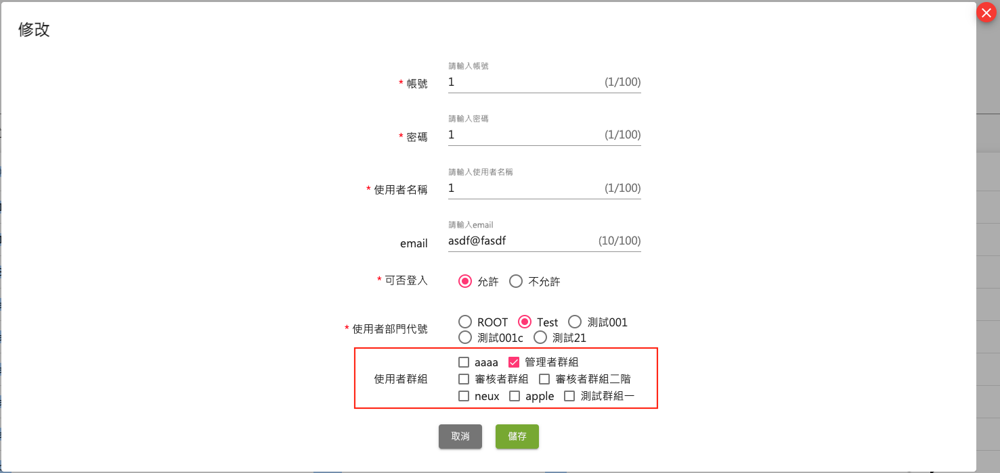

# 系統使用說明文件

## 產品簡述

CMS 全名為內容管理系統 ( content management system, 參考 [維基百科](https://zh.wikipedia.org/wiki/%E5%86%85%E5%AE%B9%E7%AE%A1%E7%90%86%E7%B3%BB%E7%BB%9F) ), 使用者只需簡單的設定步驟, 就能創建多個高度客製化的網站

產品前身為 Farm, 使用較為單純的 xml 檔案做管理與運行,
經過持續的新增、優化功能, 集農場於大成, 轉變成為大花園, 所以我們稱之為 **Garden CMS** &nbsp;

- 產品特色
  - 設定步驟簡單
  - 提供高度客製化彈性
  - 內建權限管理機制, 管控每個帳號的操作權限
  - "一" 個系統, 管理 "多" 個網站

  以上功能還無法滿足你 ? &nbsp;

  告訴我們您的需求, 由 Garden CMS 程式開發團隊, 客製化專屬您的需求 !

---

## 操作流程

- 登入

  輸入帳號、密碼、驗證碼進行登入 &nbsp;

  關於帳號的權限, 請參考 [權限控管機制 - 帳號管理](#帳號管理) 

- 主畫面
  
  - 使用者: 登入的使用者
  - 登出: 登出, 重新回到登入頁
  - 目錄: 此使用者能夠閱讀/操作的功能
  - 詳細頁面: 點擊左側目錄項目後, 顯示對應的詳細頁面
- 目錄各功能介紹
  - 多網站管理
    - 節點新增
      ...
    - 節點編輯
      ...
    - 節點預覽
      ...
  - 我的申請單
    ...
  - 審核/放行管理
    - 節點審核
      ...
    - 節點放行
      ...
  - 網站管理
    ...
  - 報表管理 ?? (問後台)
    - 權限報表
    - 使用者登入軌跡記錄
    - 登入操作功能項目紀錄
    - 審核報表
  - 中央權限管理
    - 部門管理 ?? (問後台)
    - 帳號管理 &nbsp;

      參考 [權限控管機制 - 帳號管理](#帳號管理)

    - 群組管理  &nbsp;

      參考 [權限控管機制 - 群組管理](#群組管理)
  - ~~CMS 助手~~
  - ~~智慧助手~~

---

## 附錄

### 權限控管機制

cms 以 **"群組"** 為權限控管的單位, 後續設定各帳號隸屬於什麼群組(1個帳號可以隸屬於1個或多個群組)

- #### 群組管理: 針對各群組設定 **"前台節點[^1]"**, **"後台功能"** 的權限

  (官網管理 -> 中央權限管理 -> 群組管理)
  

  - 設定前台節點: &nbsp;

    此群組對於各節點的 **"閱讀" / "新增" / "修改" / "刪除"** 權限 &nbsp;

    1. 選擇站台
  

    2. 設定該站台的各節點權限 (打勾代表有該權限)
  

  - 設定後台功能: &nbsp;

    此群組在左側目錄可不可以看得到該項目

    1. 設定目錄各項目的權限 (打勾代表看得到)
  

- #### 帳號管理: 設定帳號隸屬於哪個/些群組

  (官網管理 -> 中央權限管理 -> 群組管理)
  

  - 編輯各帳號相關資訊 (打勾代表帳號屬於該群組)
  

---

## 名詞說明

- 節點

[^1]: 《節點》...

---
