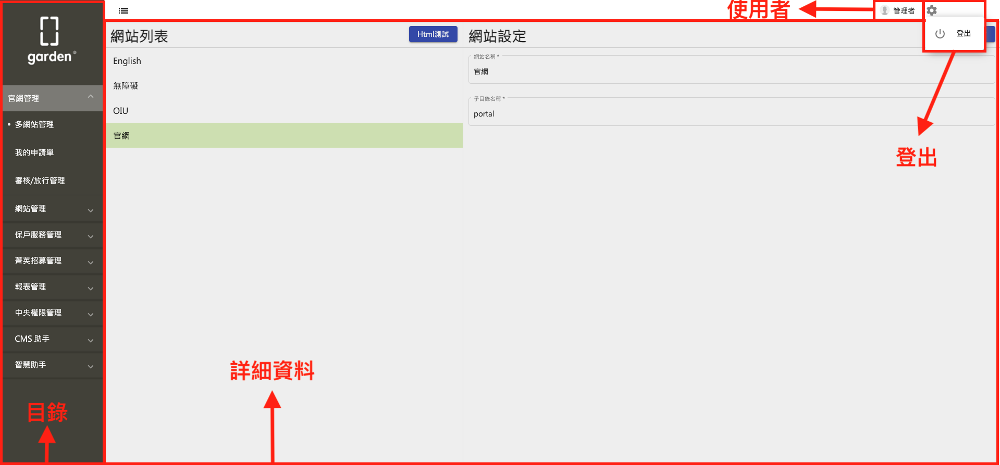
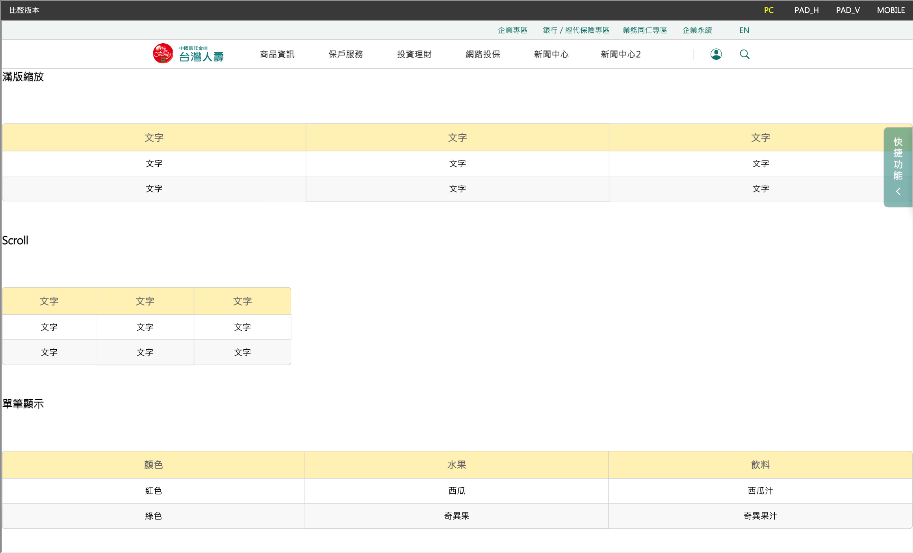

# 系統使用操作手冊

[1. 簡介](#1-簡介)

[2. 手冊查閱說明](#2-手冊查閱說明)

[3. 操作流程](#3-操作流程)
  - [3.1. 系統登入](#31-系統登入)
  - [3.2. 主畫面](#32-主畫面)
  - [3.3. 多網站管理](#33-多網站管理)
    - [3.3.1. 前台&後台相對應節點](#331-前台&後台相對應節點)
    - [3.3.2. 移動、新增、刪除、編輯節點](#332-移動、新增、刪除、編輯節點)
      - [3.3.2.1. 移動節點](#3321-移動節點)
      - [3.3.2.2. 新增節點](#3322-新增節點)
      - [3.3.2.3. 刪除節點](#3323-刪除節點)
      - [3.3.2.4. 編輯節點](#3324-編輯節點)
    - [3.3.3. 編輯、預覽、送審頁面](#333-編輯、預覽、送審頁面)
      - [3.3.3.1. 編輯頁面](#3331-編輯頁面)
      - [3.3.3.2. 預覽頁面](#3332-預覽頁面)
      - [3.3.3.3. 送審頁面](#3333-送審頁面)
    - [3.3.4. 編輯器模組](#334-編輯器模組)
      - [3.3.4.1. 版型編輯器模組](#3341-版型編輯器模組)
      - [3.3.4.2. 文稿編輯器模組](#3342-文稿編輯器模組)
  - [3.4. 我的申請單](#34-我的申請單)
  - [3.5. 審核、放行管理](#35-審核、放行管理)
  - [3.6. 網站管理](#36-網站管理)
  - [3.7. 報表管理](#37-報表管理)
    - [3.7.1. 權限報表](#371-權限報表)
    - [3.7.2. 使用者登入軌跡記錄](#372-使用者登入軌跡記錄)
    - [3.7.3. 登入操作功能項目紀錄](#373-登入操作功能項目紀錄)
    - [3.7.4. 審核報表](#374-審核報表)
  - [3.8. 中央權限管理](#38-中央權限管理)
    - [3.8.1. 部門管理](#381-部門管理)
    - [3.8.2. 帳號管理](#382-帳號管理)
    - [3.8.3. 群組管理](#383-群組管理)
      - [3.8.3.1. 設定前台節點](#3831-設定前台節點)
      - [3.8.3.2. 設定後台功能](#3832-設定後台功能)

[4. 名詞說明](#4-名詞說明)

## **1. 簡介**

  Garden CMS是由新逸資訊科技自主性研發之CMS產品，主要作為CMS管理系統來維護各網站之內容，目前已成功導入多家金融、壽險等產業，使用者可透過本產品內建相關版型模組進行網頁的自主性維護，並且可搭配Garden CMS的設計規範來擴充相關更新穎的網頁版型，藉此讓後續維護人員可無縫銜接開發相關規範，以確保全站呈現的一致性。

---

## **2. 手冊查閱說明**

  本手冊的章節以任務導向為主要，以利使用者進行系統的相關功能設定。

---

## **3. 操作流程**

- ### **3.1. 系統登入**
  
  
【圖片】登入畫面

  ◎ 欄位說明

  |輸入欄位|是否必填|類型|說明|
  |--|--|--|--|
  |使用者帳號|是|輸入框|請輸入使用者帳號|
  |使用者密碼|是|輸入框|請輸入使用者密碼|
  |驗證碼|是|輸入框|請輸入驗證碼|

   

  ◎ 圖示說明

  |圖示|功能欄位|說明|
  |--|--|--|
  ||驗證碼刷新(右側圓圈符號)|重新產生一組新的驗證碼|
  ||登入|以此帳號、密碼做登入|

   

- ### **3.2. 主畫面**
    
    
【圖片】主畫面

     ◎ 欄位說明

    |欄位|說明|
    |--|--|
    |使用者|登入的使用者資訊|
    |登出|登出, 會重新回到登入頁|
    |目錄|此使用者能夠閱讀/操作的所有功能|
    |詳細頁面|點擊左側目錄項目後, 顯示對應的詳細頁面|

   

- #### **3.3. 多網站管理**

  1. 點擊官網管理(1) ➞ 多網站管理(2) ➞ 選擇網站列表(3)

      
      
【圖片】多網站管理畫面

      ◎ 欄位說明

      |欄位|說明|
      |--|--|
      |網站列表(3)|管理的所有網站|
      |網站設定(4)|選擇左側網站列表後, 會在右側顯示網站設定頁面|

       

  2. 點擊編輯《節點》[^1]

      
      
【圖片】編輯節點按鈕畫面

       

  3. 設定節點頁面

      
      
【圖片】設定節點各功能畫面

      ◎ 欄位說明

      |欄位|說明|
      |--|--|
      |網站節點結構|瀏覽所有網站的節點結構|
      |節點詳細資料)|左側選取節點後, 右側顯示該節點詳細資料|

     

  - #### **3.3.1. 前台&後台相對應節點**

      後台設定的節點能與前台顯示畫面是相對應的，要更新前台畫面僅需在後台調整節點排列即可。

      
      
【圖片】後台節點畫面畫面

       

      
      
【圖片】前台節點畫面畫面

       

  - #### **3.3.2. 移動、新增、刪除、編輯節點**
    - #### **3.3.2.1. 移動節點**

      1. 將欲移動的節點長按滑鼠左鍵, 以"拖曳"方式移動到要擺放的位置 (移動時出現的灰色橫條代表此節點能夠放的位置)

          範例: 若想將"測試"移動到"投資理財"下方:
          
            a. 將測試節點拖曳到投資理財節點下方

            b. 調整至灰色橫條變成黃色, 即可放開滑鼠

          
          
【圖片】設定節點各功能畫面

           

      2. 取消或確認

          放開滑鼠後, 會出現確認頁面

            
            
【圖片】移動節點取消/確認畫面

          ◎ 圖示說明

          |圖示|功能欄位|說明|
          |--|--|--|
          ||取消|取消此次節點移動並關閉頁面|
          ||確認|確認此次節點移動關閉頁面|

           

      3. 看到移動結果

          若點擊確認, 會看到此次節點移動結果

           
           
【圖片】節點移動結果畫面

       

    - #### **3.3.2.2. 新增節點**

      #### 1. 在想要新增的節點上, 按下滑鼠左鍵

        
        
【圖片】節點新增/刪除畫面

         

      #### 2. 點擊新增後, 會出現新增節點頁面

        
        
【圖片】節點新增/刪除畫面

        ◎ 欄位說明

        |輸入欄位|是否必填|類型|說明|
        |--|--|--|--|
        |顯示在主選單|否|單選框|- -|
        |限 pc 可見|否|單選框|- -|
        |限 mobile 可見|否|單選框|- -|
        |節點名稱|是|輸入框|網站主選單裡面看到的文字|
        |節點副標|否|輸入框|網站主選單裡面看到的文字|
        |節點描述|否|輸入框|網站主選單裡面看到的文字|
        |節點類型|否|下拉選單|選項: 無 / 連結 / 頁面|
        |*連結類型*|是|下拉選單|節點類型選擇"連結"才會顯示， 選項: 站內 / 站外|
        |*另開視窗*|是|下拉選單|節點類型選擇"連結"才會顯示， 選項: 是 / 否|
        |*站內節點ID*|是|輸入框|連結類型選擇"站內"才會顯示|
        |*站外網址*|是|輸入框|連結類型選擇"站外"才會顯示|
        |*版面元件*|是|下拉選單|節點類型選擇"頁面"才會顯示， 選項: 後台給的選項， 此欄位是用來決定該節點的大 layout|
        |*節點連結路徑*|否|輸入框|節點類型選擇"頁面"才會顯示|
        |Meta標題|是|輸入框|TODO-前台|
        |Meta描述|否|輸入框|TODO-前台|
        |Meta關鍵字|否|輸入框|TODO-前台|
        |Meta圖片|否|圖片|TODO-前台|
        |可選擇群組|是|下拉選單(可複選)|選項: 中央權限管理 ➞ 群組管理看到的所有群組, 打勾代表群組對此節點有"閱讀", "修改"的權限, 在儲存時, 才會更新權限給後台|

         

    - #### **3.3.2.3. 刪除節點**

      1. 在想要刪除的節點上, 按下滑鼠左鍵 ➞ 點擊刪除

          
          
【圖片】節點新增/刪除畫面

           

      2. 確認是否刪除

          
          
【圖片】節點新增的取消/確認畫面

          ◎ 圖示說明

          |圖示|功能欄位|說明|
          |--|--|--|
          ||取消|取消此次節點刪除並關閉頁面|
          ||確認|確認此次節點刪除關閉頁面|

           

    - #### **3.3.2.4. 編輯節點**

      1. 點擊編輯節點

          
          
【圖片】編輯節點按鈕畫面

           

      2. 出現編輯節點頁面

            
            
【圖片】編輯節點頁面

            欄位說明請參閱 [新增節點](#2-點擊新增後-會出現新增節點頁面), 僅差別在

            1. 節點編輯不能改節點類型

            2. 節點編輯可以一次改多個語系, 而節點新增會把設定好的資料回填到每個語系

       

  - #### **3.3.3. 編輯、預覽、送審頁面**
    - #### **3.3.3.1. 編輯頁面**

      1. 點擊頁面編輯(只有節點類型是"頁面"才有此按鈕)

          
          
【圖片】頁面編輯按鈕畫面

        
         

      2. 頁面編輯各功能

          
          
【圖片】頁面編輯各功能畫面

          ◎ 欄位說明

          |欄位|說明|
          |--|--|
          |操作功能區塊|頁面編輯各項操作功能|
          |多語系|如果此節點有多個語系, 這邊就會有多個 tab|
          |編輯頁面的內容|此節點實際瀏覽看到的樣子|

           

      - **操作功能區塊**

        ◎ 圖示說明

        |圖示|功能欄位|說明|
        |--|--|--|
        ||存檔|將目前編輯的內容儲存|
        ||復原|復原成上一步|
        ||重做|重做下一步|
        ||步驟|可以看到過去的步驟歷程, 點擊還原到該步驟的頁面|
        ||清除全部|將目前頁面清空|
        ||關閉|關閉頁面編輯功能|
        ||歷史版本|可以看到過去發佈過的版本歷史, 點擊還原到該版本的頁面|

         

      - **編輯頁面的內容**
        - **新增《版型》[^2]**

          #### 1. 有"綠色+"的區塊, 代表可以在該處新增一個版型

            
            
【圖片】新增版型畫面

             

          #### 2. 新增版面(點擊綠色+後, 會在左邊展開"新增版面"功能面版)

            關於版型編輯器細部操作，請參閱 [3.3.4.1. 版型編輯器模組](#3341-版型編輯器模組)

            
            
【圖片】選擇欲新增的版型畫面

             

          #### 3. 點擊主題版型(1) ➞ 按鈕版型(A)(此處以新增按鈕版型當範例)

            
             
【圖片】按鈕版型畫面

              

          #### 4. 點擊確認

            
            
【圖片】新增版型的取消/確認畫面

             

          #### 5. 看到新增完的版型(A 按鈕版型可以對應到 [【圖片】按鈕版型畫面](#3-點擊主題版型(1)-➞-按鈕版型(A)(此處以新增按鈕版型當範例)))

            
            
【圖片】新增完按鈕版型結果畫面

             

        - **編輯版型**
          1. 點擊頁面上欲修改的欄位或版型(此處以 button 版型右邊按鈕當範例)

          2. 右側出現修改版型面版

              
              
【圖片】修改版型面版

              - A - 版型資訊: 此版型的相關資訊

              - B - 版型共通操作:

                ◎ 圖示說明

                |圖示|功能欄位|說明|
                |--|--|--|
                ||版型限制|點擊版型限制後, 會跳出版型限制描述的頁面  |
                ||上移|將此版型往上移動一個版型單位|
                ||下移|將此版型往下移動一個版型單位|
                ||刪除|將此版型從內容中刪除|

              - C - 版型操作: 依據不同的版型, 可能會顯示不同的欄位, 主要會設定該版型的行為、內容、排列、是否顯示等等

              - D - 套用變更: 如果 C 區有更改過, 點擊套用變更看到看到改變後的結果

               

          3. 修改內文變成"我是右邊的按鈕喔"後, 點擊套用變更

              
              
【圖片】修改版型內容面版

               
            
          4. 可以看到編輯頁面已經套用改變後的文字了
              
              
              
【圖片】修改內文後的編輯畫面

               

          5. 點擊左上角存檔

              
              
【圖片】存檔按鈕畫面

               

          6. 預覽頁面(詳細步驟請參閱 [3.3.3.2. 預覽頁面](#3332-預覽頁面))

              可以看到預覽頁面也已經套用改變後的文字了
              
              
【圖片】修改內文後的預覽畫面

               

    - #### **3.3.3.2. 預覽頁面**
      1. 點擊預覽(只有節點類型是"頁面"才有此按鈕)

          
          
【圖片】預覽按鈕畫面

           

      2. 頁面預覽

          
          
【圖片】頁面預覽各功能畫面

      - 操作功能區塊:

        - 比較版本

          比較目前發佈的正式版本與當前版本的差異，以利編輯者參考改動變化的幅度。

            
            
【圖片】比較版本差異畫面

             

        - 預覽各螢幕尺寸的顯示畫面

          提供一頁式設計，切換右上角裝置種類按鈕，即可即時預覽網頁在螢幕各尺寸的表現，以利編輯者打造能夠適應不同裝置、提供最佳瀏覽體驗的網站。

           ◎ 各螢幕尺寸說明

            |按鈕文字|說明|
            |--|--|
            |PC|電腦版，寬度即為當前螢幕寬度|
            |PAD_H|平版橫式，寬度為 1024px|
            |PAD_V|平版直式，寬度為 768px|
            |MOBILE|手機版，寬度為 375px|

           

    - #### **3.3.3.3. 送審頁面**

      如果要更新正式環境看到的節點內容, 必須要經過編輯 ➞ 送審 ➞ 放行三個階段, 此處說明"送審"階段

      1. 選擇要更新的節點, 然後點擊頁面送審後, 會出現送審頁面

          
          
【圖片】節點送審頁面

         

      2. 填寫上架時間、下架時間、本次送審描述後, 按下送出

         

      3. 後續等待主管同意/退回(請參閱 [3.5. 審核、放行管理](#35-審核、放行管理))

         

  - #### **3.3.4. 編輯器模組**

    編輯器模組採用所見即所得的方式進行編輯，編輯模式分為兩種:

    |編輯模式|說明|
    |--|--|
    |版型編輯器模組|針對已設計過的版型進行挑選後修改版型中的圖片、文字、連結等，不可針對版型原有設計再做更動，但排版上美觀度較佳。|
    |文稿編輯器模組|針對常見的文字、項目符號、表格、基本圖片進行編輯，無版型概念進行由上到下的編輯，較適合基本的內頁文字或相關文案說明網頁。|

     

    - #### **3.3.4.1. 版型編輯器模組**

      版型依照功能性區分為四種型態: 主題版型、頁籤版型、消息版型、客製版型，以下針對不同型態做說明。

      - #### 1. 主題版型

        針對UI/UX設計完後，將統計所有頁面並取出圖文式的版型集合，這些版型集合即為主題版型，以利編輯者能對網頁內容做自由排列組合，以達到自主性編排之效。

        
        
【圖片】新增主題版型（範例: 影音版型）

        ◎ 版型分類說明

        |版型分類|說明|
        |--|--|
        |主題版型|有固定的結構, 僅可以對內容做修改|
        |頁籤版型|提供多種結構、樣式的頁籤版型|
        |消息版型|有固定的結構及樣式, 僅可以對其資料來源做修改|
        |客製版型|根據不同專案提供的客製化版型|

         

      - #### 2. 頁籤版型

        針對UI/UX設計完後，將統計所有頁面並取出頁籤式的版型集合，以利編輯者能對網頁內容隨意增減頁籤版型，此外頁籤數量也可以彈性增減，各頁籤底下也可以再拉入其他版型或是頁籤版型。

        
        
【圖片】新增頁籤類版型（範例: 頁籤版型）

         

      - #### 3. 消息版型

        針對最新消息、輪播、常見問題、表單下載等消息發佈類型提供的版型，版型樣式已經設計完成，編輯者僅需要設定消息來源即可更新網頁內容。

        
        
【圖片】新增消息類版型（範例: 最新消息版型）

         

        
        
【圖片】設定消息來源畫面

         

      - #### 4. 客製版型

        針對專案客製化在網站上需揭露的客製化功能(如商品諮詢、服務據點等)，每一個客製化功能連同驗證規則、商業邏輯、畫面UI等會一併視為一個版型，供編輯者在網頁中若需要加入客製化功能時能自主性擴充，對於IT後續維運只需維護一套source code即可對應多頁面更新。

        
        
【圖片】新增客製類版型（範例: 服務據點版型）

         

    - #### **3.3.4.2. 文稿編輯器模組**

      版型編輯器主要針對設計過後的版型進行文字、圖片、連結等內容編輯，但網站上需揭露例如法規或條文式的內容，而這些內容大多採用表格或項目符號進行排列，在Garden CMS中內建提供文稿編輯器供編輯者進行這些文字型的內容進行編排，下述針對條文內容、表格型態等進行說明。

      1. 點擊打開編輯器

          
          
【圖片】編輯器設定面版

           

      2. HTML 編輯器畫面

          
          
【圖片】HTML 編輯器畫面

           

          ◎ 圖示說明

          |圖示|功能欄位|說明|
          |--|--|--|
          ||編輯器說明|說明所有編輯器的功能|
          ||粗體|將選取的字變粗體|
          ||斜體|將選取的字變斜體|
          ||底線|將選取的字變加上底線|
          ||居中|將選取的字置中|
          ||置左|將選取的字靠左|
          ||置右|將選取的字靠右|
          ||清單|將選取的內容下方加一個清單子項目|
          ||增加縮排|將選取的內容增加縮排|
          ||減少縮排|將選取的內容減少縮排|
          ||標記文字|將選取的字標記特殊樣式|
          ||插入連結|連結類型分為: 站內節點連結、站外連結、客製化動作|
          ||插入檔案|檔案來源有: 加入本地檔案、表單下載(可以從網站管理 ➞ 表單下載管理做設定)|
          ||插入圖片|將選取處插入圖片|
          ||插入表格|將選取處插入表格|
          ||插入 Youtube 影片|將選取處插入 Youtube 影片 |

           

          - 插入表格

            Garden CMS針對表格可支援自由新增刪除行列、合併儲存格等機制。

              
              
【圖片】插入表格

               

            此外, 編輯器也可以支援於 word 中複製表格並貼上, 編輯器會自動過濾掉 word 原訂的表格樣式(背景色、框線、字體等)後轉換成符合網站風格的表格樣式，便於編輯者在進行表格編輯時提升易用性。

              
              
【圖片】word 複製畫面

              
               
              
              
              
【圖片】word 表格貼上編輯器後的畫面

               

            ◎ 表格選取方式說明

              
              
【圖片】選取表格畫面

              |表格選取方式|說明|操作|
              |--|--|--|
              |區塊式|欲選取的區域是正方形或長方形區塊|按住 shift 之後, 滑鼠拖曳範圍即為選取區塊|
              |散落式|欲選取的區域是不規則形或是彼此沒有相連|按住 control (macOS 按住 command) 之後, 滑鼠點擊區塊即為選取區塊|

               

            ◎ 表格樣式說明

            滿版縮放、Scroll、單筆顯示三種表格樣式可供選擇，以利使用者獲得表格瀏覽最佳體驗。

              
              
【圖片】設定表格樣式畫面

              |表格樣式|說明|
              |--|--|
              |滿版縮放|螢幕的寬度即為表格的寬度|
              |Scroll|可以手動調整表格的寬度, 若表格寬度大於當前裝置螢幕, 以滑動的方式即可看到所有內容|
              |單筆顯示|表格寬度大於當前裝置螢幕, 會將一個表格拆分成兩個來顯示|

               

              
              
【圖片】編輯模式三種表格樣式畫面

               

              
              
【圖片】預覽模式(電腦版)三種表格樣式畫面

               

              
              
【圖片】預覽模式(手機版)三種表格樣式畫面

          - 插入 Youtube 影片

            編輯器也支援將 Youtube 影片內嵌在網頁中，直接設定 Youtube 網址即可。

            
            
【圖片】插入 Youtube 設定頁面

             

            
            
【圖片】插入 Youtube 後編輯頁面

             

            
            
【圖片】插入 Youtube 後預覽頁面

             

- #### **3.4. 我的申請單**

  1. 點擊官網管理 ➞ 我的申請單, 顯示我的申請單詳細資料頁面

      
      
【圖片】我的申請單畫面

       

  2. 點擊操作功能後, 會出現操作頁面

      
      
【圖片】我的申請單操作頁面

        - 點擊審核紀錄後, 出現紀錄頁面

            
            
【圖片】我的申請單審核紀錄頁面

        TODO-後台 看後台怎麼設定 ? 有規則嗎 ?

        - 點擊預覽後, 會出現預覽頁面顯示詳細資料

            
            
【圖片】我的申請單預覽詳細資料頁面

        - 點擊預覽後, 會另開分頁預覽此次送審節點畫面

            
            
【圖片】我的申請單預覽網站內容畫面

         

- #### **3.5. 審核、放行管理**

  1. 點擊官網管理 ➞ 審核/放行管理後, 會看到右側審核/放行管理畫面

      
       
【圖片】審核、放行管理模組畫面

        

  2. 點擊操作功能後, 會出現操作頁面

      
       
【圖片】審核、放行管理操作頁面

      - 點擊同意後, 出現審核通過頁面

          
          
【圖片】審核、放行管理審核通過頁面

          ◎ 圖示說明

          |圖示|功能欄位|說明|
          |--|--|--|
          ||取消|取消此次操作並關閉頁面|
          ||通過|同意並通過此筆送審並關閉頁面|

         

      - 點擊退回後, 出現審核退回頁面
        
          
          
【圖片】審核、放行管理審核退回頁面

          ◎ 圖示說明

          |圖示|功能欄位|說明|
          |--|--|--|
          ||取消|取消此次操作並關閉頁面|
          ||退回|退回此筆送審並關閉頁面|

         

      - 預覽: 會另開分頁預覽此次送審節點

          
          
【圖片】審核、放行管理預覽此筆送審的網站畫面

         

  3. 如果要審核/放行多筆, 可以使用批次功能

        
        
【圖片】審核、放行管理批次操作畫面

       

- #### **3.6. 網站管理**

  此模組設計主要考量到若有版型會同時顯示在多個頁面，且版型的內容是根據“資料”決定的（例如: 最新消息），為了減少編輯者需要同時維護多個頁面的不便性，故將這類版型的資料統一在網站管理進行單一登打，再透過程式直接撈取資料庫資料顯示於網頁中，同時也可確保版型在多個頁面的一致性。

  網站管理具有最新消息、常見問題、輪播管理三種模組。

  ◎ 模組說明

  |模組|說明|
  |--|--|
  |最新消息|提供網站一般所需的公告、優惠、消息等發佈維護功能，提供新增、修改、刪除資料，消息類型也可透過最新消息分類管理進行擴充維運。|
  |常見問題|提供網站一般所需的常見問題發佈維護功能，提供新增、修改、刪除資料，問題類型也可透過常見問題分類管理進行擴充維運，分類進行維護時也可指定該分類底下的資料由哪個群組權限進行維護。|
  |輪播管理|提供網站一般所需的輪播發佈維護功能，提供新增、修改、刪除資料，輪播類型也可透過輪播分類管理進行擴充維運。|

   

  1. 點擊官網管理 ➞ 網站管理，會出現所有屬於網站管理模組的項目，此處以“最新消息管理”作範例說明

      
      
【圖片】網站管理各功能畫面（範例: 最新消息分類管理）

      - 最新消息分類管理

          以分類的方式管理所有的最新消息，可指定該分類底下的資料由哪個群組權限進行維護，以達到不同消息類型交由不同編輯者群組進行維護，常見問題分類管理、輪播分類管理以此類推。

           
          
          
【圖片】最新消息分類管理畫面

           

          
          
【圖片】最新消息版型，選擇資料來源畫面（對應到上方圖片 <a href="#newsTypeManagement">最新消息分類管理畫面</a> ）

           
         
          
          
【圖片】修改最新消息分類管理畫面

          ◎ 欄位說明

          |輸入欄位|是否必填|類型|說明|
          |--|--|--|--|
          |類別ID|是|輸入框|此分類唯一ID|
          |類別名稱|是|輸入框|此分類顯示的名稱|
          |上層分類|否|下拉選單|TODO-後台|
          |是否顯示|是|單選框|此分類是否會在版型的選取資料來源選單顯示|
          |可存取群組|是|複選框|能夠存取此分類的群組|

           

          ◎ 圖示說明

          |圖示|功能欄位|說明|
          |--|--|--|
          ||取消|取消此次修改並關閉頁面|
          ||儲存|儲存此次修改並關閉頁面|

           

       

      - 最新消息管理

          發佈一筆最新消息，可設定要發佈到哪些最新消息分類，以達到一稿多頁面發佈之效，減少編輯者重覆登打資料的困擾，常見問題管理、輪播管理以此類推。

          
          
          
【圖片】最新消息管理畫面（紅框處項目皆屬於“官網-最新消息“分類）

           

          
          
【圖片】最新消息版型，資料來源選擇”官網-最新消息“分類畫面（對應到上方圖片 <a href="#newsManagement">最新消息管理畫面</a> ）

           

          
          
【圖片】修改最新消息管理畫面

          ◎ 欄位說明

          |輸入欄位|是否必填|類型|說明|
          |--|--|--|--|
          |標題|是|輸入框|此消息的標題|
          |內頁連結方式|是|單選框|選項: 自行編輯內容 / 外連|
          |*內容*|否|HTML 編輯器版型|內頁連結方式選擇"自行編輯內容"才會顯示，設定此筆最新消息顯示的畫面|
          |*連結路徑*|否|輸入框|內頁連結方式選擇"外連"才會顯示，設定此筆最新消息外連的網址|
          |*連結是否另開分頁*|是|單選框|內頁連結方式選擇"外連"才會顯示， 選項: 是 / 否|
          |顯示日期|是|日期|此消息開始顯示的日期|
          |發佈位置|是|多選框|此消息隸屬於哪些最新消息分類，以此達到一稿多頁面發佈之效|

           

          ◎ 圖示說明

          |圖示|功能欄位|說明|
          |--|--|--|
          ||取消|取消此次修改並關閉頁面|
          ||儲存|儲存此次修改並關閉頁面|

           

- #### **3.7. 報表管理**

  - #### **3.7.1. 權限報表**

    1. 點擊官網管理 ➞ 報表管理 ➞ 權限報表後, 右側會看到權限報表頁面, 顯示每個帳號的權限資訊 (如何設定權限請參閱 [3.8. 中央權限管理](#38-中央權限管理))

          
          
【圖片】權限報表畫面

          ◎ 欄位說明

          |欄位|說明|
          |--|--|
          |搜尋條件|輸入想要搜尋的條件, 有清除、查詢兩種動作|
          |搜尋結果|根據上方的搜尋條件, 所查詢出的結果|
          |資料筆數資訊|顯示每頁幾筆資料、當前顯示筆數及總筆數|
          |切換上下頁按鈕|點擊切換上下頁按鈕, 會根據頁數條件重新查詢並顯示結果|

       

  - #### **3.7.2. 使用者登入軌跡記錄**

    1. 點擊官網管理 ➞ 報表管理 ➞ 使用者登入軌跡記錄後, 右側會看到使用者登入軌跡記錄頁面, 顯示每個使用者登入的詳細紀錄

        
        
【圖片】使用者登入軌跡記錄畫面

         

  - #### **3.7.3. 登入操作功能項目紀錄**

    1. 點擊官網管理 ➞ 報表管理 ➞ 登入操作功能項目紀錄後, 會看到登入操作功能項目紀錄頁面, 顯示每個使用者登入的操作詳細紀錄

        
        
【圖片】登入操作功能項目紀錄畫面

         

  - #### **3.7.4. 審核報表**

    1. 點擊官網管理 ➞ 報表管理 ➞ 審核報表後, 會看到審核報表頁面, 顯示所有審核的歷程

        
        
【圖片】審核報表畫面

        TODO-後台
        - 操作: 點擊操作會有以下兩種動作, 視後台如何設定

          1. 詳細資料頁面

              

               

          2. 另開分頁預覽此節點內容

              
              
【圖片】審核報表預覽節點內容畫面

           

- #### **3.8. 中央權限管理**

  - #### **3.8.1. 部門管理**

    部門管理提供新增、修改、刪除部門功能，以讓管理者在 cms 建立相關部門資料，並可針對各別部門給予對應的部門權限。(TODO-後台)

     

  - #### **3.8.2. 帳號管理**

    帳號管理提供新增、修改、刪除帳號功能，並可針對每一個帳號設定對應的功能群組，以利控制不同帳號登入 cms 後台可操作哪些功能項目，以及可存取前台哪些節點。

    1. 官網管理(1) ➞ 中央權限管理(2) ➞ 帳號管理(3)

        
        
【圖片】審核報表預覽節點內容畫面

       

    - #### E - 新增帳號
      1. 點擊新增按鈕後, 會出現輸入資料的頁面

          
          
【圖片】新增帳號頁面

          ◎ 欄位說明

          |輸入欄位|是否必填|類型|說明|
          |--|--|--|--|
          |帳號|是|輸入框|設定帳號|
          |密碼|是|輸入框|設定密碼|
          |使用者名稱|是|輸入框|設定使用者名稱|
          |email|否|輸入框|設定email|
          |可否登入|是|單選框|設定可否登入|
          |使用者部門代號|是|單選框|設定使用者隸屬於哪個部門|
          |使用者群組|否|複選框|設定使用者隸屬於哪個/哪些群組|

           

          ◎ 圖示說明

          |圖示|功能欄位|說明|
          |--|--|--|
          ||取消|取消此次變動並關閉頁面|
          ||儲存|儲存此帳號資訊並關閉頁面|

           

    - #### F - 預覽
      1. 點擊操作中的預覽按鈕, 會出現顯示此帳號資料的頁面

          
          
【圖片】預覽帳號頁面

         

    - #### G - 編輯
      請參閱 [E - 新增帳號](#E---新增帳號), 僅差別在編輯會在頁面各欄位帶出原本的資料, 而新增就是全部為空

       

  - #### **3.8.3. 群組管理**

    群組管理提供新增、修改、刪除群組功能，並且可針對每一個群組設定登入 cms 後台可操作哪些功能項目，以及可存取前台哪些節點。

    1. 官網管理(1) ➞ 中央權限管理(2) ➞ 群組管理(3)

        
        
【圖片】群組管理各功能頁面

     

    - #### **3.8.3.1. 設定前台節點**

      此群組對於各節點的 **"閱讀"、"新增"、"修改"、"刪除"** 權限
      1. 點擊"設定前台節點"圖示, 會出現設定頁面

      2. 選擇站台

          
          
【圖片】選擇站台畫面

           

      3. 設定該站台的各節點權限 (打勾代表有該權限)

          
          
【圖片】設定站台節點權限畫面

           

      4. 取消或是儲存

          頁面最下方, 會有取消、儲存兩顆按鈕

          ◎ 圖示說明

          |圖示|功能欄位|說明|
          |--|--|--|
          ||取消|取消此次變動並關閉頁面|
          ||儲存|儲存此節點設定並關閉頁面|

           

    - #### **3.8.3.2. 設定後台功能**

      此群組在左側目錄可不可以看得到該項目

      1. 設定目錄各項目的權限 (打勾代表此群組在目錄看得到此功能)

          
          
【圖片】群組管理各功能頁面

           

      2. 取消或是儲存

          頁面最下方, 會有取消、儲存兩顆按鈕

         ◎ 圖示說明
         
         |圖示|功能欄位|說明|
         |--|--|--|
         ||取消|取消此次變動並關閉頁面|
         ||儲存|儲存此節點設定並關閉頁面|

          

---

## **4. 名詞說明**

[^1]: 《節點》管理頁面以及權限控管的基本單位, 具有階層性。
[^2]: 《版型》定義網站看到的實際畫面, 每個頁面可由一個到多個版型組成。

---

    <a href="#系統使用操作手冊" class="back-to-top-link" aria-label="Scroll to Top">
↑</a>

