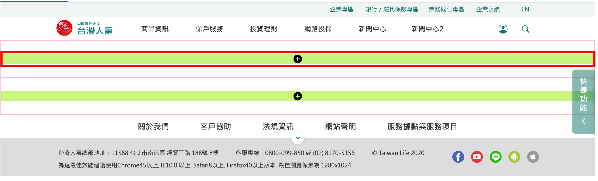
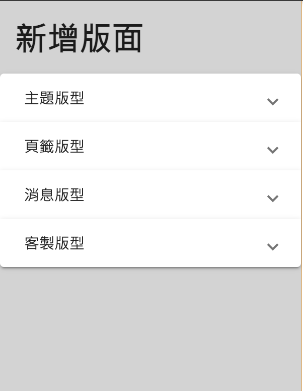
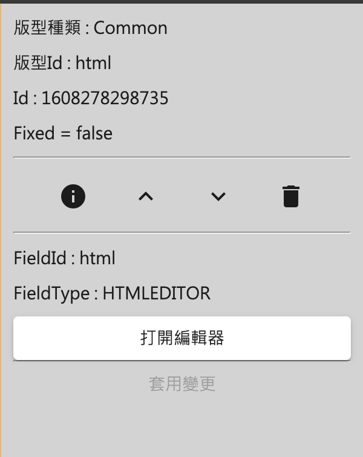

# 系統使用說明文件

## 產品簡述

### Garden CMS

CMS 全名為內容管理系統, 使用者只需簡單的設定步驟, 就能創建多個高度客製化的網站

產品前身為 Farm, 使用較為單純的 xml 檔案做管理與運行,
經過持續的新增、優化功能, 集農場於大成, 轉變成為大花園, 所以我們稱之為 Garden CMS

- 產品特色
  - 設定步驟簡單
  - 提供高度客製化彈性
  - 內建權限管理機制, 管控每個帳號的操作權限
  - "一" 個系統, 管理 "多" 個網站

---

## 操作流程

- 登入

  輸入帳號、密碼、驗證碼進行登入

  關於帳號的權限, 請參考 [權限控管機制 - 帳號管理](#帳號管理-設定帳號隸屬於哪個些群組)

- 主畫面
  
  - *使用者: 登入的使用者*
  - *登出: 登出, 重新回到登入頁*
  - *目錄: 此使用者能夠閱讀/操作的功能*
  - *詳細頁面: 點擊左側目錄項目後, 顯示對應的詳細頁面*
- 目錄各功能介紹
  - **多網站管理**

    1. 官網管理 -> 多網站管理
      
        - *網站列表: 管理的多個網站*
        - *網站設定: 左側網站列表選取後, 顯示詳細頁面*

    2. 點擊編輯節點
      

    3. 設定節點頁面
      
        - *網站節點結構: 可以看出各節點的階層性*
        - *節點詳細資料: 左側選取節點後, 右側顯示該節點詳細資料*

        - **節點新增 / 刪除**

          在想要操作的節點上, 按下滑鼠左鍵(關於節點新增 / 刪除的權限, 請參考 [權限控管機制 - 群組管理 - 設定前台節點](#設定前台節點))
            

          - **節點新增**

            點擊新增後, 跳出 popup

              

            |設定欄位|必填|類型|備註|
            |--|--|--|--|
            |顯示在主選單|X|checkbox|- -|
            |限 pc 可見|X|checkbox|- -|
            |限 mobile 可見|X|checkbox|- -|
            |節點名稱|V|input|網站主選單裡面看到的文字|
            |節點副標|X|input|網站主選單裡面看到的文字|
            |節點描述|X|input|網站主選單裡面看到的文字|
            |節點類型|X|select|選項: 無 / 連結 / 頁面|
            |*連結類型*|V|select|節點類型選擇"連結"才會顯示 選項: 站內 / 站外|
            |*另開視窗*|V|select|節點類型選擇"連結"才會顯示 選項: 是 / 否|
            |*站內節點ID*|V|input|連結類型選擇"站內"才會顯示|
            |*站外網址*|V|input|連結類型選擇"站外"才會顯示|
            |*版面元件*|V|select|節點類型選擇"頁面"才會顯示 選項: 後台給的選項 此欄位是用來決定該節點的大 layout|
            |*節點連結路徑*|X|input|節點類型選擇"頁面"才會顯示|
            |Meta標題|V|input||
            |Meta描述|Z|input||
            |Meta關鍵字|Z|input||
            |Meta圖片|X|加入圖片||
            |可選擇群組|V|select(可複選)|選項: 中央權限管理 -> 群組管理看到的所有群組 打勾代表群組對此節點有"閱讀", "修改"的權限, 在儲存時, 才會更新權限給後台|

          - **節點刪除**

            點擊刪除(此操作不可復原!)

      - **節點編輯**

        1. 點擊編輯節點
          

        2. 編輯節點 popup

            

        節點編輯與節點新增差別在於

          1. 節點編輯不能改節點類型

          2. 節點編輯可以一次改多個語系, 而節點新增會把設定好的資料回填到每個語系

    - **頁面編輯**

      1. 點擊頁面編輯(只有節點類型是"頁面"才有此按鈕)
      

      2. 頁面編輯區塊
      
      - *操作功能區塊: 頁面編輯各項操作功能*
      - *多語系: 如果此節點有多個語系, 這邊就會有多個 tab*
      - *編輯頁面的內容: 此節點實際瀏覽看到的樣子*

      - **操作功能區塊**
        - 存檔: 將目前編輯的內容儲存

          

        - 復原: 復原成上一步

          

        - 重做: 重做下一步

          

        - 步驟: 可以看到過去的步驟歷程, 點擊還原到該步驟的頁面

          

        - 清除全部: 將目前頁面清空

          

        - 關閉: 關閉頁面編輯功能

          

        - 歷史版本: 可以看到過去發佈過的版本歷史, 點擊還原到該版本的頁面

          

      - **編輯頁面的內容**
        - **新增版型**

          1. 有"綠色+"的區塊, 代表可以在該處新增一個版型
          

          2. 新增版面(點擊綠色+後, 會在左邊展開"新增版面"功能面版)
          
          - *版型分類*
            - *固定版型: 有固定的結構, 僅可以對內容做修改*
            - *頁籤版型: 提供多種結構、樣式的頁籤版型*
            - *動態版型: 有固定的結構及樣式, 僅可以對其資料來源做修改*
            - *客製版型: 根據不同專案提供的客製化版型*

          3. 選擇欲新增的版型, 點擊確認即可
          

        - **編輯版型**
          1. 點擊頁面上欲修改的版型

              
          - *A - 版型資訊: 此版型的相關資訊*

          - *B - 版型共通操作:*
            - *版型限制:*

              *點擊版型限制 icon 後, 會跳出版型限制描述的 popup*

              

            - *上移:*

              *將此版型往上移動一個版型單位*

              

            - *下移:*

              *將此版型往下移動一個版型單位*

              

            - *刪除:*

              *將此版型刪除*

              

          - *C - 版型操作: 依據不同的版型, 可能會顯示不同的欄位, 主要會設定該版型的行為、內容、排列、是否顯示等等*

          - *D - 套用變更: 如果 C 區有更改過, 點擊套用變更看到看到改變後的結果*
        - **html 編輯器版型**

          html 編輯器也是屬於一種版型, 操作方式較為獨特, 故特別拉出來做說明

          功能: 可以想像成是精煉版的 word, 具有填寫內容、調整文字樣式、插入表格、插入超連結、插入圖片等等功能

          操作:
          1. 點擊打開編輯器

              

          2. html 編輯器畫面

              

          3. 點擊左上角編輯器說明, 會跳出編輯器使用方式, 此處就不贅述了

              

    - **頁面預覽**
      1. 點擊預覽(只有節點類型是"頁面"才有此按鈕)
      

      2. 頁面預覽
      
      - *操作功能區塊:*
        - *比較版本*

          *比較發佈的正式版本與當前版本的差異*
          

        - *預覽各螢幕尺寸的顯示畫面*
          - *PC: 當前螢幕寬度*
          - *PAD_H: 寬度 1024px*
          - *PAD_V: 寬度 768px*
          - *MOBILE: 寬度 375px*

    - **頁面送審**

      如果要更新正式環境看到的節點內容, 必須要經過編輯 -> 送審 -> 放行三個階段, 此處說明"送審"階段

      1. 選擇要更新的節點, 然後點擊頁面送審後, 會跳出送審 popup
      

      2. 填寫上架時間、下架時間、本次送審描述後, 按下送出

      3. 後續等待主管同意/退回, 如果同意即可在正式環境看到新的畫面(請參考[審核/放行管理](#審核放行管理))

  - **我的申請單**

    1. 點擊官網管理 -> 我的申請單, 顯示我的申請單詳細資料頁面

        

    2. 點擊操作後, 跳出操作 popup

        

          - *點擊審核紀錄後, 跳出紀錄 popup*
            

          - *點擊預覽後, 會另開分頁預覽此次送審節點畫面*

  - #### **審核/放行管理**

    1. 點擊官網管理 -> 審核/放行管理後, 會看到右側審核/放行管理頁面
      

    2. 點擊操作後, 跳出操作 popup
      

        - *點擊同意後, 跳出 popup*
          

        - *點擊退回後, 跳出 popup*
          

        - *預覽: 會另開分頁預覽此次送審節點*

    3. 如果要審核/放行多筆, 可以使用批次功能
      

  - 網站管理

    主要負責管理“動態版型”的資料來源

    1. 點擊官網管理 -> 審核/放行管理後, 會看到右側審核/放行管理頁面
      

    - 新增
      

  - 報表管理 ?? (問後台)
    - 權限報表
      1. 點擊官網管理 -> 報表管理 -> 權限報表後, 右側會看到權限報表頁面, 顯示每個帳號的權限資訊
        

          - #### *搜尋條件: 輸入想要搜尋的條件, 有查詢或是清除所有搜尋條件兩種動作*
          - #### *搜尋結果: 根據上方帶的搜尋條件, 所帶出來的結果*
          - #### *資料筆數資訊: 顯示每頁幾筆資料、當前顯示筆數及總筆數*
          - #### *切換上下頁按鈕: 點擊切換上下頁按鈕, 畫面會顯示對應的結果*

    - 使用者登入軌跡記錄
      1. 點擊官網管理 -> 報表管理 -> 使用者登入軌跡記錄後, 右側會看到使用者登入軌跡記錄頁面, 顯示每個使用者登入的詳細紀錄
          

            - *搜尋條件: 同[權限報表-搜尋條件](#搜尋條件:輸入想要搜尋的條件,有查詢或是清除所有搜尋條件兩種動作)*
            - *搜尋結果: 同[權限報表-搜尋結果](#搜尋結果:根據上方帶的搜尋條件,所帶出來的結果)*
            - *資料筆數資訊: 同[權限報表-資料筆數資訊](#資料筆數資訊:顯示每頁幾筆資料、當前顯示筆數及總筆數)*
            - *切換上下頁按鈕: 同[權限報表-切換上下頁按鈕](#切換上下頁按鈕:點擊切換上下頁按鈕,畫面會顯示對應的結果)*

    - 登入操作功能項目紀錄
      1. 點擊官網管理 -> 報表管理 -> 登入操作功能項目紀錄後, 會看到登入操作功能項目紀錄頁面, 顯示每個使用者登入的操作詳細紀錄
          

            - *搜尋結果: 同[權限報表-搜尋結果](#搜尋結果:根據上方帶的搜尋條件,所帶出來的結果)*
            - *資料筆數資訊: 同[權限報表-資料筆數資訊](#資料筆數資訊:顯示每頁幾筆資料、當前顯示筆數及總筆數)*
            - *切換上下頁按鈕: 同[權限報表-切換上下頁按鈕](#切換上下頁按鈕:點擊切換上下頁按鈕,畫面會顯示對應的結果)*

    - 審核報表
      1. 點擊官網管理 -> 報表管理 -> 審核報表後, 會看到審核報表頁面, 顯示所有審核的歷程
          

            - *搜尋條件: 同[權限報表-搜尋條件](#搜尋條件:輸入想要搜尋的條件,有查詢或是清除所有搜尋條件兩種動作)*
            - *搜尋結果: 同[權限報表-搜尋結果](#搜尋結果:根據上方帶的搜尋條件,所帶出來的結果)*
            - *操作: ...*
            - *資料筆數資訊: 同[權限報表-資料筆數資訊](#資料筆數資訊:顯示每頁幾筆資料、當前顯示筆數及總筆數)*
            - *切換上下頁按鈕: 同[權限報表-切換上下頁按鈕](#切換上下頁按鈕:點擊切換上下頁按鈕,畫面會顯示對應的結果)*

  - 中央權限管理
    - 部門管理 ...(問後台)
    - 帳號管理

      參考 [權限控管機制 - 帳號管理](#帳號管理-設定帳號隸屬於哪個些群組)

    - 群組管理

      參考 [權限控管機制 - 群組管理](#群組管理-針對各群組設定-前台節點-後台功能-的權限)
  - ~~CMS 助手~~
  - ~~智慧助手~~

---

## 附錄

### 權限控管機制

cms 以 **"群組"** 為權限控管的單位, 後續設定各帳號隸屬於什麼群組(1個帳號可以隸屬於1個或多個群組)

- #### 群組管理: 針對各群組設定 **"前台節點[^1]"**, **"後台功能"** 的權限

  (官網管理 -> 中央權限管理 -> 群組管理)
  

  - #### 設定前台節點

    此群組對於各節點的 **"閱讀" / "新增" / "修改" / "刪除"** 權限

    1. 選擇站台

        

    2. 設定該站台的各節點權限 (打勾代表有該權限)

        

  - #### 設定後台功能:

    此群組在左側目錄可不可以看得到該項目

    1. 設定目錄各項目的權限 (打勾代表看得到)

        

- #### 帳號管理: 設定帳號隸屬於哪個/些群組

  (官網管理 -> 中央權限管理 -> 群組管理)

    

  - *編輯各帳號相關資訊 (打勾代表帳號屬於該群組)*

    

---

## 名詞說明

[^1]: 《節點》...

---
