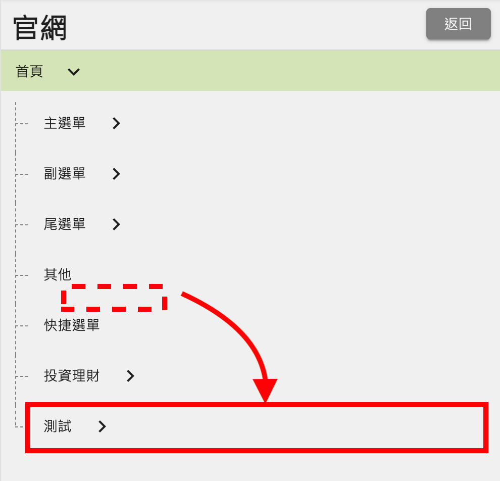
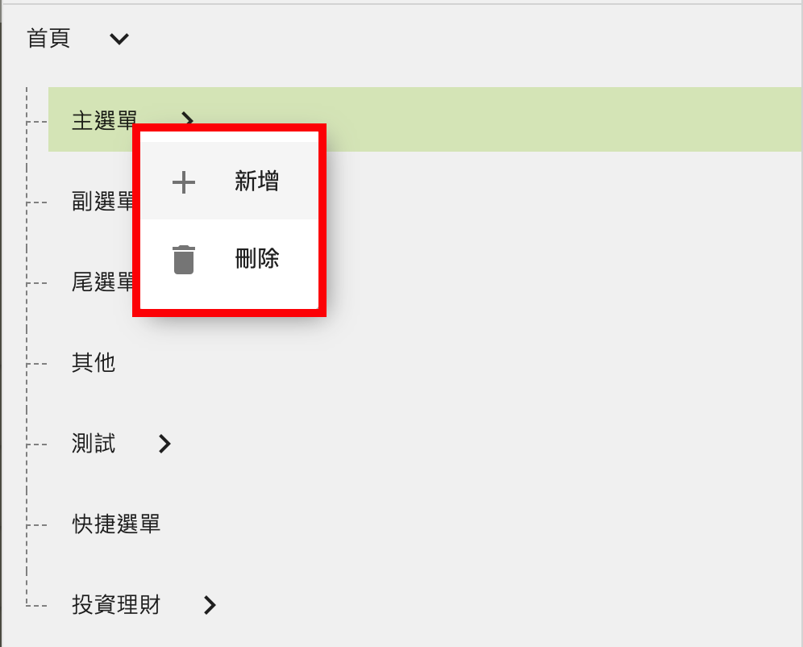
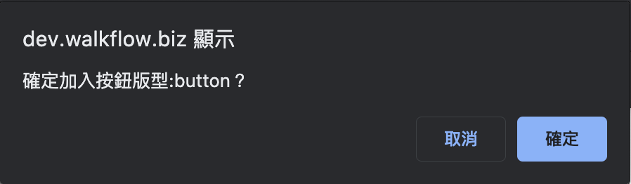
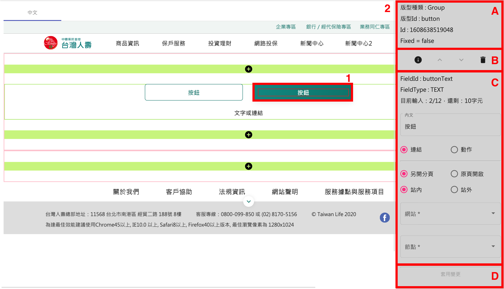
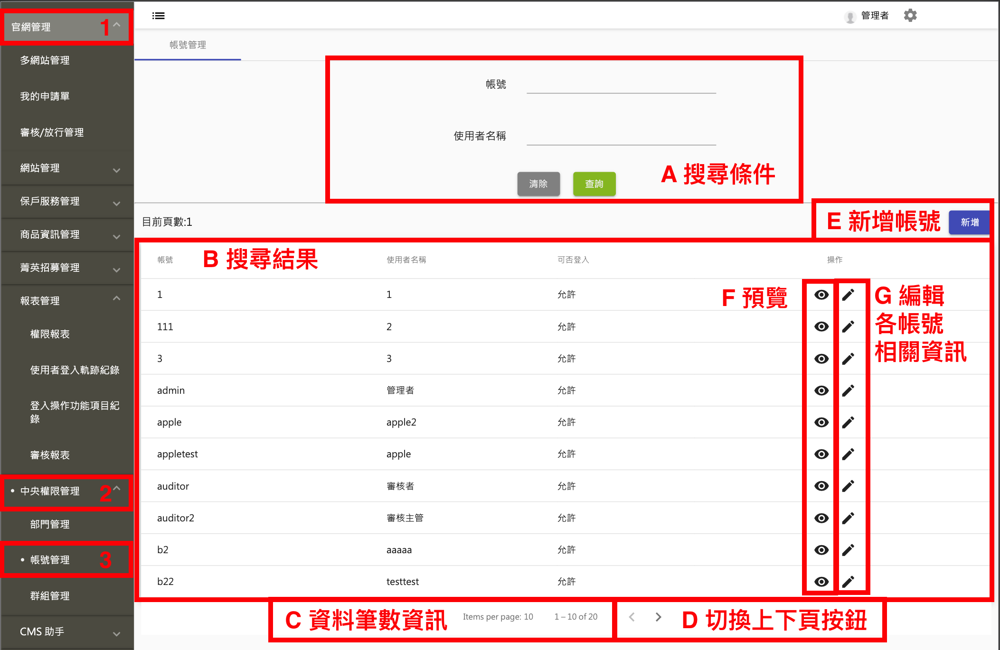

# 系統使用操作手冊

[1. 前言](#1-前言)

[2. 手冊查閱說明](#2-手冊查閱說明)

[3. 操作流程](#3-操作流程)
  - [3.1. 系統登入](#31-系統登入)
  - [3.2. 主畫面](#32-主畫面)
  - [3.3. 多網站管理](#331-多網站管理)
    - [3.3.1. 移動、新增、刪除、編輯節點](#331-移動、新增、刪除、編輯節點)
      - [3.3.1.1. 移動節點](#3311-移動節點)
      - [3.3.1.2. 新增節點](#3312-新增節點)
      - [3.3.1.3. 刪除節點](#3313-刪除節點)
      - [3.3.1.4. 編輯節點](#3314-編輯節點)
    - [3.3.2. 編輯、預覽、送審頁面](#332-編輯、預覽、送審頁面)
      - [3.3.2.1. 編輯頁面](#3321-編輯頁面)
      - [3.3.2.2. 預覽頁面](#3322-預覽頁面)
      - [3.3.2.3. 送審頁面](#3323-送審頁面)
  - [3.4. 我的申請單](#34-我的申請單)
  - [3.5. 審核、放行管理](#35-審核、放行管理)
  - [3.6. 網站管理](#36-網站管理)
  - [3.7. 報表管理](#37-報表管理)
    - [3.7.1. 權限報表](#371-權限報表)
    - [3.7.2. 使用者登入軌跡記錄](#372-使用者登入軌跡記錄)
    - [3.7.3. 登入操作功能項目紀錄](#373-登入操作功能項目紀錄)
    - [3.7.4. 審核報表](#374-審核報表)
  - [3.8. 中央權限管理](#38-中央權限管理)
    - [3.8.1. 部門管理](#381-部門管理)
    - [3.8.2. 帳號管理](#382-帳號管理)
    - [3.8.3. 群組管理](#383-群組管理)
      - [3.8.3.1. 設定前台節點](#3831-設定前台節點)
      - [3.8.3.2. 設定後台功能](#3832-設定後台功能)

[4. 注意事項及常見問題](#4-注意事項及常見問題)

[5. 附錄](#5-附錄)

[6. 名詞說明](#6-名詞說明)

## **1. 前言**

  本專案目標為建置台灣人壽之新一代全球資訊網，除了原有官方入口網站既有的功能以重新設計及升級方式移轉至新系統平台外，也將導入新型態的內容管理及數位行銷架構，以提供更穩定、功能更強大的網站系統。

  以Responsive Web Design的設計原理，建置新官網，並提供一套內容管理與開發平台以利後續開發使用。

---

## **2. 手冊查閱說明**

  本手冊的章節以任務導向為主要，以利使用者進行系統的相關功能設定。

---

## **3. 操作流程**

- ### **3.1. 系統登入**
  

  ◎ 欄位說明
  
  |輸入欄位|是否必填|類型|說明|
  |--|--|--|--|
  |使用者帳號|是|輸入框|請輸入使用者帳號|
  |使用者密碼|是|輸入框|請輸入使用者密碼|
  |驗證碼|是|輸入框|請輸入驗證碼|

   

  ◎ 圖示說明
  |圖示|功能欄位|說明|
  |--|--|--|
  ||驗證碼刷新(右側圓圈符號)|重新產生一組新的驗證碼|
  ||登入|以此帳號、密碼做登入|

  FIXME
  關於帳號的權限, 請參考 [中央權限管理 - 帳號管理](#382-帳號管理)
  

- ### **3.2. 主畫面**
    

     ◎ 欄位說明
    |欄位|說明|
    |--|--|
    |使用者|登入的使用者資訊|
    |登出|登出, 會重新回到登入頁|
    |目錄|此使用者能夠閱讀/操作的所有功能|
    |詳細頁面|點擊左側目錄項目後, 顯示對應的詳細頁面|

- #### **3.3. 多網站管理**

  1. 點擊官網管理(1) -> 多網站管理(2) -> 選擇網站列表(3)
    
      ◎ 欄位說明
      |欄位|說明|
      |--|--|
      |網站列表(3)|管理的所有網站|
      |網站設定(4)|選擇左側網站列表後, 會在右側顯示網站設定頁面|

  2. 點擊編輯《節點》[^1]
    

  3. 設定節點頁面
    
      - 網站節點結構: 可以看出各節點的階層性
      - 節點詳細資料: 左側選取節點後, 右側顯示該節點詳細資料

  - #### **3.3.1. 移動、新增、刪除、編輯節點**
    - #### **3.3.1.1. 移動節點**

      1. 將欲移動的節點長按滑鼠左鍵, 以"拖曳"方式移動到要擺放的位置 (移動時出現的灰色橫條代表此節點能夠放的位置)

          範例: 若想將"測試"移動到"投資理財"下方
          a. 將測試節點拖曳到投資理財節點下方
          b. 調整至灰色橫條變成黃色, 即可放開滑鼠
          

      2. 取消或確認

          放開滑鼠後, 會出現確認頁面
            

          ◎ 圖示說明
          |圖示|功能欄位|說明|
          |--|--|--|
          ||取消|取消此次節點移動並關閉頁面|
          ||確認|確認此次節點移動關閉頁面|

      3. 看到移動結果

          若點擊確認, 會看到此次節點移動結果
           

    - #### **3.3.1.2. 新增節點**

      #### 1. 在想要新增的節點上, 按下滑鼠左鍵

        

      #### 2. 點擊新增後, 會出現新增節點頁面

        

        |輸入欄位|是否必填|類型|說明|
        |--|--|--|--|
        |顯示在主選單|否|單選框|- -|
        |限 pc 可見|否|單選框|- -|
        |限 mobile 可見|否|單選框|- -|
        |節點名稱|是|輸入框|網站主選單裡面看到的文字|
        |節點副標|否|輸入框|網站主選單裡面看到的文字|
        |節點描述|否|輸入框|網站主選單裡面看到的文字|
        |節點類型|否|下拉選單|選項: 無 / 連結 / 頁面|
        |*連結類型*|是|下拉選單|節點類型選擇"連結"才會顯示 選項: 站內 / 站外|
        |*另開視窗*|是|下拉選單|節點類型選擇"連結"才會顯示 選項: 是 / 否|
        |*站內節點ID*|是|輸入框|連結類型選擇"站內"才會顯示|
        |*站外網址*|是|輸入框|連結類型選擇"站外"才會顯示|
        |*版面元件*|是|下拉選單|節點類型選擇"頁面"才會顯示 選項: 後台給的選項 此欄位是用來決定該節點的大 layout|
        |*節點連結路徑*|否|輸入框|節點類型選擇"頁面"才會顯示|
        |Meta標題|是|輸入框|TODO|
        |Meta描述|否|輸入框|TODO|
        |Meta關鍵字|否|輸入框|TODO|
        |Meta圖片|否|圖片|TODO|
        |可選擇群組|是|下拉選單(可複選)|選項: 中央權限管理 -> 群組管理看到的所有群組, 打勾代表群組對此節點有"閱讀", "修改"的權限, 在儲存時, 才會更新權限給後台|

    - #### **3.3.1.3. 刪除節點**

      1. 在想要刪除的節點上, 按下滑鼠左鍵

          

      2. 點擊刪除(此操作不可復原!)

    - #### **3.3.1.4. 編輯節點**

      1. 點擊編輯節點
        

      2. 出現編輯節點頁面

          

          請參考 [新增節點](#2-點擊新增後-會出現新增節點頁面), 僅差別在

          1. 節點編輯不能改節點類型

          2. 節點編輯可以一次改多個語系, 而節點新增會把設定好的資料回填到每個語系

  - #### **3.3.2. 編輯、預覽、送審頁面**
    - #### **3.3.2.1. 編輯頁面**

      1. 點擊頁面編輯(只有節點類型是"頁面"才有此按鈕)
      

      2. 頁面編輯區塊
      

          ◎ 欄位說明
          |欄位|說明|
          |--|--|
          |操作功能區塊|頁面編輯各項操作功能|
          |多語系|如果此節點有多個語系, 這邊就會有多個 tab|
          |編輯頁面的內容|此節點實際瀏覽看到的樣子|

      - **操作功能區塊**

        ◎ 圖示說明
        |圖示|功能欄位|說明|
        |--|--|--|
        ||存檔|將目前編輯的內容儲存|
        ||復原|復原成上一步|
        ||重做|重做下一步|
        ||步驟|可以看到過去的步驟歷程, 點擊還原到該步驟的頁面|
        ||清除全部|將目前頁面清空|
        ||關閉|關閉頁面編輯功能|
        ||歷史版本|可以看到過去發佈過的版本歷史, 點擊還原到該版本的頁面|

      - **編輯頁面的內容**
        - **新增《版型》[^2]**

          #### 1. 有"綠色+"的區塊, 代表可以在該處新增一個版型

            

          #### 2. 新增版面(點擊綠色+後, 會在左邊展開"新增版面"功能面版)

            

            ◎ 版型分類說明
            |版型分類|說明|
            |--|--|
            |主題版型|有固定的結構, 僅可以對內容做修改|
            |頁籤版型|提供多種結構、樣式的頁籤版型|
            |消息版型|有固定的結構及樣式, 僅可以對其資料來源做修改|
            |客製版型|根據不同專案提供的客製化版型|

          #### 3. 點擊主題版型(1) -> 按鈕版型(A)(此處以新增按鈕版型當範例)

            

          #### 4. 點擊確認

            

          #### 5. 看到新增完的版型(A 按鈕版型可以對應到 [新增版型區塊圖片](#3-範例-若要新增按鈕版型-步驟為-點擊主題版型1-->-按鈕版型A))

            

        - **編輯版型**
          1. 點擊頁面上欲修改的欄位或版型(此處以 button 版型右邊按鈕當範例)

          2. 右側出現修改版型面版

              
          - A - 版型資訊: 此版型的相關資訊

          - B - 版型共通操作:

              ◎ 圖示說明
              |圖示|功能欄位|說明|
              |--|--|--|
              ||版型限制|點擊版型限制後, 會跳出版型限制描述的頁面  |
              ||上移|將此版型往上移動一個版型單位|
              ||下移|將此版型往下移動一個版型單位|
              ||刪除|將此版型從內容中刪除|

          - C - 版型操作: 依據不同的版型, 可能會顯示不同的欄位, 主要會設定該版型的行為、內容、排列、是否顯示等等

          - D - 套用變更: 如果 C 區有更改過, 點擊套用變更看到看到改變後的結果

          3. 修改內文變成"我是右邊的按鈕喔"後, 點擊套用變更

              
            
              可以看到編輯頁面已經套用改變後的文字了
              

          4. 點擊左上角存檔

              

          5. 預覽頁面(步驟請參考 [3.3.2.2. 預覽頁面](#3322-預覽頁面))

              可以看到預覽頁面也已經套用改變後的文字了
              

              <!-- HERE -->

        - **html 編輯器版型**

          html 編輯器也是屬於一種版型, 操作方式較為獨特, 故特別拉出來做說明

          功能: 可以想像成是精煉版的 word, 具有填寫內容、調整文字樣式、插入表格、插入超連結、插入圖片等等功能

          操作:
          1. 點擊打開編輯器

              

          2. html 編輯器畫面

              

          3. 點擊左上角編輯器說明, 會跳出編輯器使用方式, 此處就不贅述了

              

    - #### **3.3.2.2. 預覽頁面**
      1. 點擊預覽(只有節點類型是"頁面"才有此按鈕)
      

      2. 頁面預覽
      
      - *操作功能區塊:*
        - *比較版本*

          *比較發佈的正式版本與當前版本的差異*
          

        - *預覽各螢幕尺寸的顯示畫面*
          - *PC: 當前螢幕寬度*
          - *PAD_H: 寬度 1024px*
          - *PAD_V: 寬度 768px*
          - *MOBILE: 寬度 375px*

    - #### **3.3.2.3. 送審頁面**

      如果要更新正式環境看到的節點內容, 必須要經過編輯 -> 送審 -> 放行三個階段, 此處說明"送審"階段

      1. 選擇要更新的節點, 然後點擊頁面送審後, 會出現送審頁面
      

      2. 填寫上架時間、下架時間、本次送審描述後, 按下送出

      3. 後續等待主管同意/退回, 如果同意即可在正式環境看到新的畫面(請參考 [審核/放行管理](#審核放行管理))

- #### **3.4. 我的申請單**

  1. 點擊官網管理 -> 我的申請單, 顯示我的申請單詳細資料頁面

      

  2. 點擊操作功能後, 會出現操作頁面

      

        - *點擊審核紀錄後, 跳出紀錄頁面*
          

        - *點擊預覽後, 會另開分頁預覽此次送審節點畫面*

- #### **3.5. 審核、放行管理**

  1. 點擊官網管理 -> 審核/放行管理後, 會看到右側審核/放行管理頁面
    

  2. 點擊操作功能後, 會出現操作頁面
    

      - 點擊同意後, 出現審核通過頁面
        

      - 點擊退回後, 出現審核退回頁面
        

      - 預覽: 會另開分頁預覽此次送審節點

  3. 如果要審核/放行多筆, 可以使用批次功能
    

- #### **3.6. 網站管理**

  主要負責管理“動態版型”的資料來源

  1. 點擊官網管理 -> 審核/放行管理後, 會看到右側審核/放行管理頁面
    

  - 新增
    

- #### **3.7. 報表管理**
  - #### **3.7.1. 權限報表**
    1. 點擊官網管理 -> 報表管理 -> 權限報表後, 右側會看到權限報表頁面, 顯示每個帳號的權限資訊
      

        - #### 搜尋條件: 輸入想要搜尋的條件, 有查詢或是清除所有搜尋條件兩種動作
        - #### 搜尋結果: 根據上方帶的搜尋條件, 所帶出來的結果
        - #### 資料筆數資訊: 顯示每頁幾筆資料、當前顯示筆數及總筆數
        - #### 切換上下頁按鈕: 點擊切換上下頁按鈕, 畫面會顯示對應的結果

  - #### **3.7.2. 使用者登入軌跡記錄**
    1. 點擊官網管理 -> 報表管理 -> 使用者登入軌跡記錄後, 右側會看到使用者登入軌跡記錄頁面, 顯示每個使用者登入的詳細紀錄
        

          - *搜尋條件: 同[權限報表-搜尋條件](#搜尋條件-輸入想要搜尋的條件-有查詢或是清除所有搜尋條件兩種動作)*
          - *搜尋結果: 同[權限報表-搜尋結果](#搜尋結果-根據上方帶的搜尋條件-所帶出來的結果)*
          - *資料筆數資訊: 同[權限報表-資料筆數資訊](#資料筆數資訊-顯示每頁幾筆資料當前顯示筆數及總筆數)*
          - *切換上下頁按鈕: 同[權限報表-切換上下頁按鈕](#切換上下頁按鈕-點擊切換上下頁按鈕-畫面會顯示對應的結果)*

  - #### **3.7.3. 登入操作功能項目紀錄**
    1. 點擊官網管理 -> 報表管理 -> 登入操作功能項目紀錄後, 會看到登入操作功能項目紀錄頁面, 顯示每個使用者登入的操作詳細紀錄
        

          - *搜尋結果: 同[權限報表-搜尋結果](#搜尋結果-根據上方帶的搜尋條件-所帶出來的結果)*
          - *資料筆數資訊: 同[權限報表-資料筆數資訊](#資料筆數資訊-顯示每頁幾筆資料當前顯示筆數及總筆數)*
          - *切換上下頁按鈕: 同[權限報表-切換上下頁按鈕](#切換上下頁按鈕-點擊切換上下頁按鈕-畫面會顯示對應的結果)*

  - #### **3.7.4. 審核報表**
    1. 點擊官網管理 -> 報表管理 -> 審核報表後, 會看到審核報表頁面, 顯示所有審核的歷程
        

          - *搜尋條件: 同[權限報表-搜尋條件](#搜尋條件-輸入想要搜尋的條件-有查詢或是清除所有搜尋條件兩種動作)*
          - *搜尋結果: 同[權限報表-搜尋結果](#搜尋結果-根據上方帶的搜尋條件-所帶出來的結果)*
          - *操作: 點擊操作會有以下動作, 視後台如何設定*
            1. 詳細資料頁面
              
            2. 另開分頁預覽此節點內容
          - *資料筆數資訊: 同[權限報表-資料筆數資訊](#資料筆數資訊-顯示每頁幾筆資料當前顯示筆數及總筆數)*
          - *切換上下頁按鈕: 同[權限報表-切換上下頁按鈕](#切換上下頁按鈕-點擊切換上下頁按鈕-畫面會顯示對應的結果)*

- #### **3.8. 中央權限管理**
  - #### **3.8.1. 部門管理**

    TODO 問後台

  - #### **3.8.2. 帳號管理**
    1. 官網管理(1) -> 中央權限管理(2) -> 群組管理(3)

      

    - #### A - 搜尋條件: 同[權限報表-搜尋條件](#搜尋條件-輸入想要搜尋的條件-有查詢或是清除所有搜尋條件兩種動作)
    - #### B - 搜尋結果: 同[權限報表-搜尋結果](#搜尋結果-根據上方帶的搜尋條件-所帶出來的結果)
    - #### C - 資料筆數資訊: 同[權限報表-資料筆數資訊](#資料筆數資訊-顯示每頁幾筆資料當前顯示筆數及總筆數)
    - #### D - 切換上下頁按鈕: 同[權限報表-切換上下頁按鈕](#切換上下頁按鈕-點擊切換上下頁按鈕-畫面會顯示對應的結果)
    - #### E - 新增帳號
      1. 點擊新增按鈕後, 會出現輸入資料的頁面
        

          ◎ 欄位說明
          |輸入欄位|是否必填|類型|說明|
          |--|--|--|--|
          |帳號|是|輸入框|- -|
          |密碼|是|輸入框|- -|
          |使用者名稱|是|輸入框|- -|
          |email|否|輸入框|- -|
          |可否登入|是|單選框|- -|
          |使用者部門代號|是|單選框|使用者隸屬於哪個部門|
          |使用者群組|否|複選框|使用者隸屬於哪個/哪些群組|

           

          ◎ 圖示說明
          |圖示|功能欄位|說明|
          |--|--|--|
          ||取消|取消此次變動並關閉頁面|
          ||儲存|儲存此帳號資訊並關閉頁面|

    - #### F - 預覽
      1. 點擊操作中的預覽按鈕, 會出現顯示此帳號資料的頁面
          

    - #### G - 編輯
      請參考 [E - 新增帳號](#E---新增帳號), 僅差別在編輯會在頁面各欄位帶出原本的資料, 而新增就是全部為空

  - #### **3.8.3. 群組管理**

    群組管理提供新增、修改、刪除群組功能，並且可針對每一個群組設定登入CMS後台可操作哪些功能項目，以及可存取前台哪些Sitemap節點權限

    1. 官網管理(1) -> 中央權限管理(2) -> 群組管理(3)
      

    <!-- 參考 [權限控管機制 - 群組管理](#群組管理-針對各群組設定-前台節點-後台功能-的權限) -->

    - #### **3.8.3.1. 設定前台節點**

      此群組對於各節點的 **"閱讀"、"新增"、"修改"、"刪除"** 權限
      1. 點擊"設定前台節點"圖示, 會出現設定頁面

      2. 選擇站台

          

      3. 設定該站台的各節點權限 (打勾代表有該權限)

          

      4. 取消或是儲存

          頁面最下方, 會有取消、儲存兩顆按鈕

         ◎ 圖示說明
          |圖示|功能欄位|說明|
          |--|--|--|
          ||取消|取消此次變動並關閉頁面|
          ||儲存|儲存此節點設定並關閉頁面|

    - #### **3.8.3.2. 設定後台功能**

      此群組在左側目錄可不可以看得到該項目

      1. 設定目錄各項目的權限 (打勾代表目錄看得到)

          

      2. 取消或是儲存

          頁面最下方, 會有取消、儲存兩顆按鈕

         ◎ 圖示說明
          |圖示|功能欄位|說明|
          |--|--|--|
          ||取消|取消此次變動並關閉頁面|
          ||儲存|儲存此節點設定並關閉頁面|

---

## **4. 注意事項及常見問題**

  TODO

## **5. 附錄**

## **6. 名詞說明**

[^1]: 《節點》管理頁面以及權限控管的基本單位, 具有階層性。
[^2]: 《版型》定義實際畫面的樣子, 每個頁面可由一個到多個版型組成。

---
