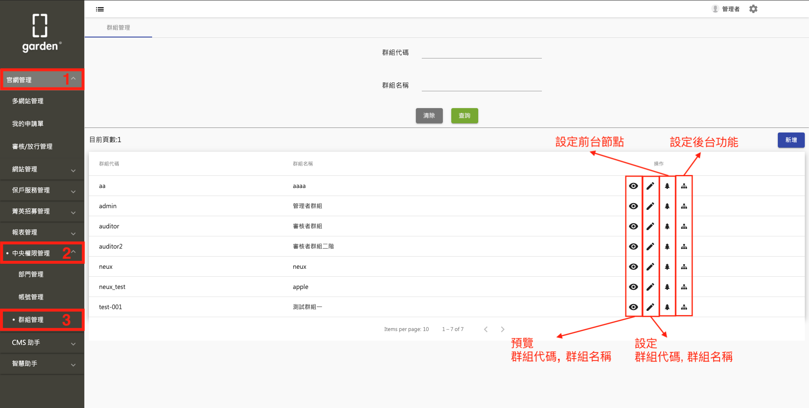
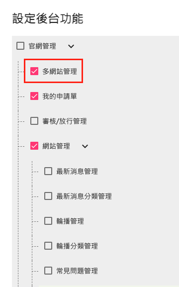

# 系統使用說明文件

## 產品簡述

何謂 CMS ?  &#13;

CMS = 內容管理系統(content management system)

在neux，我們稱為Garden,
前身為farm, 產出xml,
後來從農場轉變成一座花園。

## 權限控管機制

cms 以 **"群組"** 為權限控管的單位, 針對個別群組設定 **"後台功能"**, **"前台節點[^1]"** 的權限

- 設定前台節點: &nbsp;

  此群組對於各節點的 **"閱讀" / "新增" / "修改" / "刪除"** 權限 &nbsp;

  1. 選擇站台
  

  2. 設定該站台的各節點權限 (打勾代表有該權限)
  

- 設定後台功能: &nbsp;

  此群組在左側目錄可不可以看得到該項目

  1. 設定目錄各項目的權限 (打勾代表看得到)
  

## 操作流程

- 登入

||
|--|
|123123123|

- 主畫面
  - 使用者
  - 登出
  - 目錄
  - 詳細頁面
- 目錄各功能介紹
  - 多網站管理
  - 我的申請單
  - 審核/放行管理
  - 網站管理
  - 保戶服務管理
  - 菁英招募管理
  - 報表管理
    - 權限報表
    - 使用者登入軌跡記錄
    - 登入操作功能項目紀錄
    - 審核報表
  - 中央權限管理
    - 部門管理
    - 帳號管理
    - 群組管理
  - ~~CMS 助手~~
  - ~~智慧助手~~

### 名詞說明

- 節點

Markdown[^1]

[^1]: 《Markdown讓文字更加精緻》