# 程式提交

[1. 前言](#1-前言)

[2. 提交流程](#2-提交流程)
  - [2.1. 新增 Issues](#21-新增-issues)
  - [2.2. 創建分支](#22-創建分支)
  - [2.3. 處理 Pull Request](#23-處理-pull-request)
  - [2.4. 發佈 npm](#24-發佈-npm)
  - [2.5. 發佈 npm 通知](#25-發佈-npm-通知)

[3. 附錄](#3-附錄)
  - [3.1. github actions 做的事情](#31-github-actions-做的事情)

## 1. 前言

  訂立從接收到 issue 到發佈過程中，各階段的注意事項。請務必遵守規範，以利程式開發者之間的快速協同開發。

<br/>

## 2. 提交流程

- ### 2.1. 新增 Issues

  - 2.1.1. 點擊 github issues(1) ➞ New issue(2)

      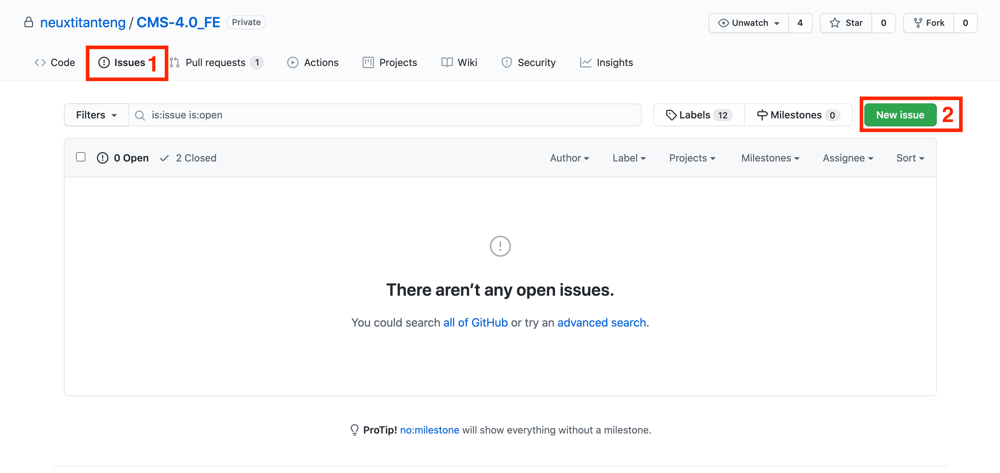
      <div class="text-center">【圖片】github issues 畫面</div>

    <br/>

  - 2.1.2. 填入相關資訊(1, 2, 3, 4) ➞ Submit new issue

      <span id="create-issues"></span>

      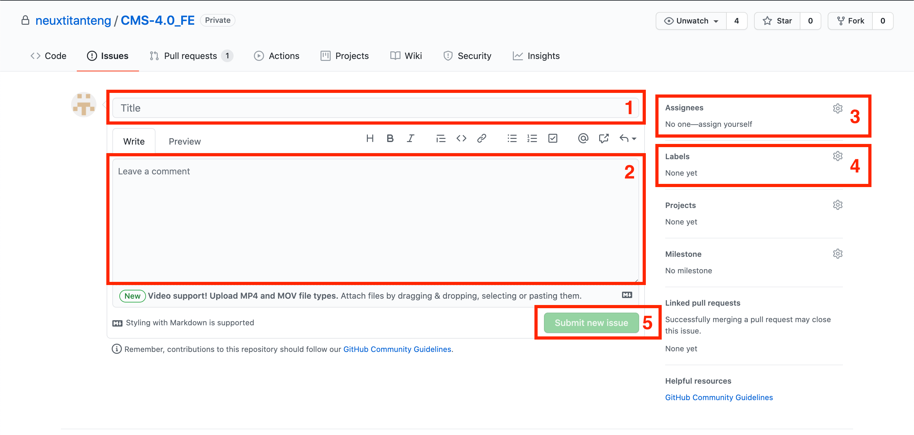
      <div class="text-center">【圖片】新增 issues 畫面</div>


      ◎ 欄位說明

      |欄位|說明|
      |--|--|
      |標題 (1)|設定此 issue 的標題(TODO 格式未定)|
      |描述 (2)|設定此 issue 的描述(TODO 格式未定)|
      |分配修復者 (3)|分配此 issue 的修復者 <br/> 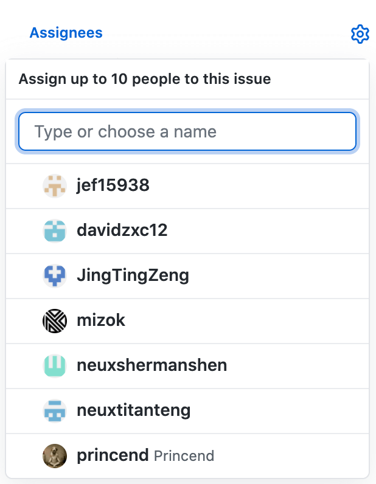|
      |標籤 (4)|設定此 issue 的標籤(通常為 feature / bug / refactor) <br/> 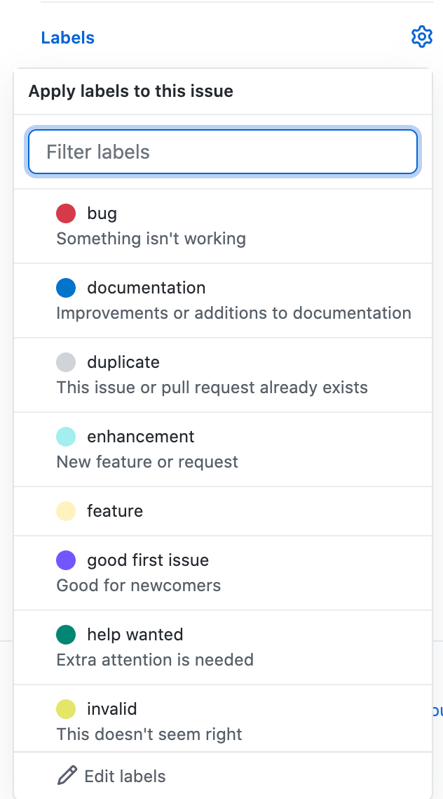|

      <br/>

  - 2.1.3. 預覽此次新增的 issue

      [【圖片】預覽 issues 畫面](#issues-preview) 能對應到 [【圖片】新增 issues 畫面](#create-issues) 的 1、2、3、4 欄位

      <span id="issues-preview"></span>

      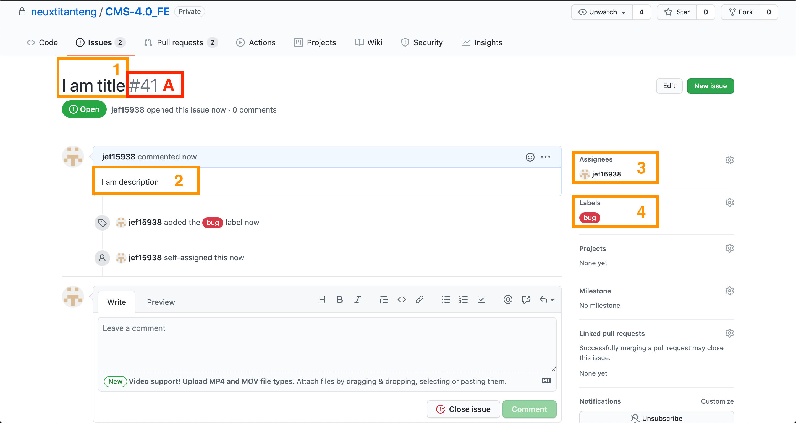
      <div class="text-center">【圖片】預覽 issues 畫面</div>

      ◎ 欄位說明

      |欄位|說明|
      |--|--|
      |github issue 序號|此為 github 自動產生的獨特序號，後續 Pull Request 需要標記設定修復哪個/些 issues，就是拿此序號作為標記|

  <br/>

- ### 2.2. 創建分支

  - 2.2.1. 從當前 dev 分支創建另一條分支做程式新增/修改/重構

    `git checkout -b <branch-name>`

    此指令相當於 `git branch <branch-name> && git checkout <branch-name>`

- ### 2.3. 處理 Pull Request

    每次新增/修復/重構完成的程式，會先交由 RD Leader 檢閱並核可過該程式，才可以合併回 dev 分支，確保程式的邏輯正確及品質

  - 2.3.1. 點擊 Pull requests(1) ➞ New pull request(2)

    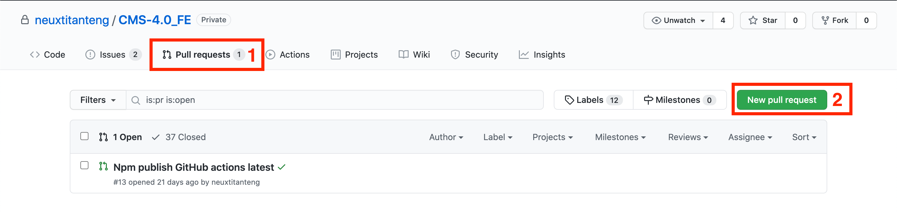
    <div class="text-center">【圖片】pull request 畫面</div>

  <br/>

  - 2.3.2. 選取分支並點擊 Create pull request

    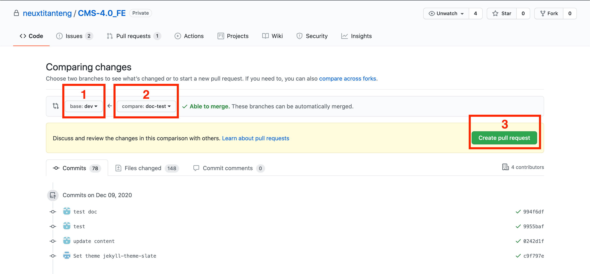
    <div class="text-center">【圖片】新增 pull request 畫面 (選取分支)</div>

    ◎ 欄位說明

    |欄位|說明|
    |--|--|
    |目標分支 (1)|設定欲合併的目標分支 (通常為 dev, 除非要發佈時會選擇 master)|
    |來源分支 (2)|設定欲合併的來源分支|
    |新增 pull request 按鈕 (3)|點擊會出現新增 pull request 畫面 (填寫詳細資訊)|

    <br/>

  - 2.3.3. 填寫相關資訊並點擊 Create pull request

      <span id="pr-detail"></span>

      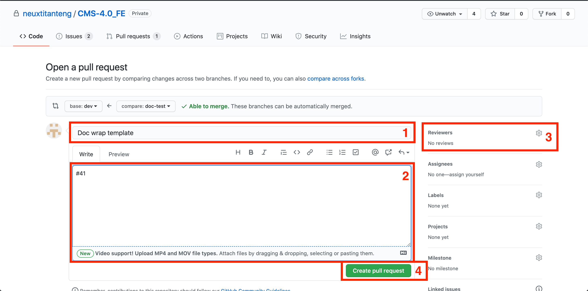
      <div class="text-center">【圖片】新增 pull request 畫面 (填寫詳細資訊)</div>

      ◎ 欄位說明

      |欄位|說明|
      |--|--|
      |標題 (1)|設定此 pr 的標題(TODO 格式未定)|
      |描述 (2)|設定此 pr 的描述, 填寫此 pr 修復哪個/些 issues(使用#\<pr-編號\來標記>，範例: #41)(TODO 格式未定)|
      |分配審核者 (3)|分配此 pr 的審核者 <br/> 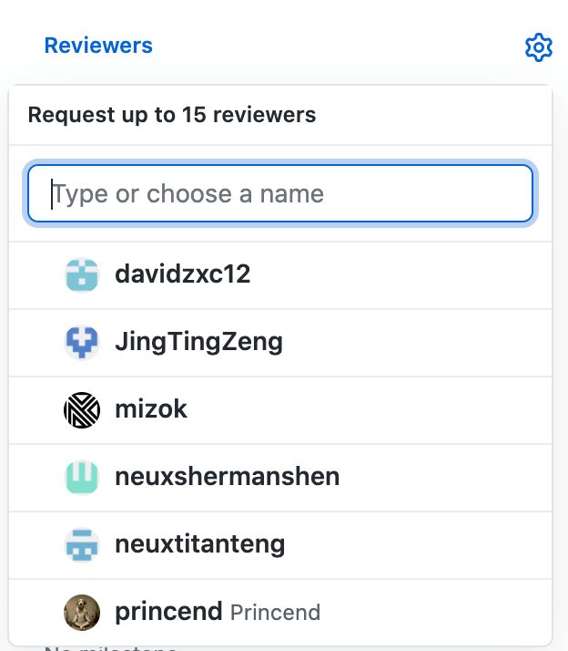|

      <br/>

  - 2.3.4. 通知 RD Leader review pull request

    [【圖片】預覽 pull request 畫面](#pr-preview) 能對應到 [【圖片】新增 pull request 畫面 (填寫詳細資訊)](#pr-detail) 的 1、2、3 欄位

    <span id="pr-preview"></span>

    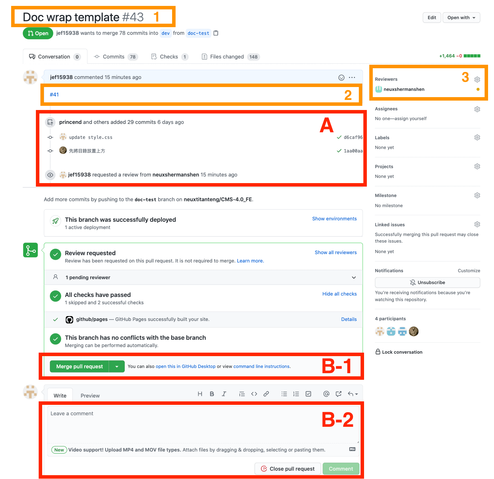
    <div class="text-center">【圖片】預覽 pull request 畫面</div>

    ◎ 欄位說明

    |欄位|說明|
    |--|--|
    |合併 pr 按鈕(B-1)|若 RD Leader 審核此 pr 為通過，點擊此按鈕，會將改動合併到 dev 分支|
    |新增評論區塊 (B-2)|若 RD Leader 審核此 pr 為"不"通過或是對於 pr 想做特別說明，可以新增評論(TODO 格式未定)|

  <br/>

- ### 2.4. 發佈 npm

  - 2.4.1. 更改版號(TODO 版號吃同一個地方 )

    - cms 版號: lib / render / package.json
    - render 版號: lib / cms-core / package.json

  - 2.4.2. github commit && push 觸發 github actions

    根據 commit message 決定是否發佈此程式到 npm, 發佈 next 還是 latest 版本

    ### commit message 格式

    ```
    git commit -m <msg>
    <msg> = npm-publish-next | npm-publish-latest
    ```
    <br/>

- ### 2.5. 發佈 npm 通知

    <span id="npm-publish-notification"></span>

    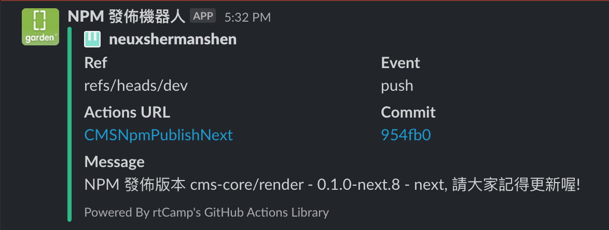
    <div class="text-center" style="width: 600px">【圖片】發佈 npm 後 slack 通知畫面</div>

    <br/>

---

## 3. 附錄

- ### 3.1. github actions 做的事情

  1. **Setup npmrc** : 為了取得 private repo dependency access

  2. **Install Dependency** : `rm -rf ./node_nodules && npm install`

  3. **Build** :

      3.1. render : `npm run build-render-lib`

      3.2. cms : `npm run build-cms-lib`

  4. **Npm publish** :

      4.1. render : `cd ./dist/libs/render && npm publish --tag=$\{\{env.npm_version_tag\}\}`

      4.2. cms : `cd ./dist/libs/cms-core && npm publish --tag=$\{\{env.npm_version_tag\}\}`

  5. **Read npm publish 版本號碼** : 從 ./package.json 取得版本號碼

  6. **在 github 押 tag** :

      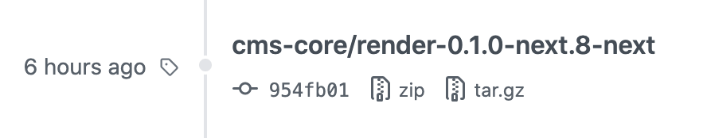
      <div class="text-center" style="width: 600px">【圖片】github tags</div>

  7. **Slack notification** : 發佈通知, 提醒大家更新 dependency

      同 [【圖片】發佈 npm 後 slack 通知畫面](#npm-publish-notification)

<link rel="stylesheet" type="text/css" href="./style/style.css" />

<div class="back-to-top-wrapper">
    <a href="#程式提交" class="back-to-top-link" aria-label="Scroll to Top">↑</a>
</div>