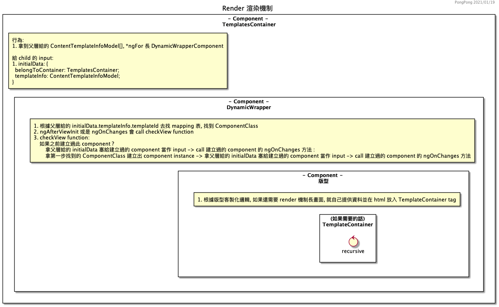

# Render 渲染機制

[1. Render 渲染機制描述](#1-render-渲染機制描述)

[2. Render 渲染機制圖示](#2-render-渲染機制圖示)

---

## 1. Render 渲染機制描述

  此部分著重在 Render 如何拿到資料後，以遞迴方式渲染出所有 Component。

  關於資料從哪裡來，請參閱 <a href="./route-control" target="_blank">路由控制文件</a>

  渲染機制主要由以下 Component 所組成:

  - ### Component - TemplatesContainer

    - 渲染機制的入口，接到 @Input() templates: ContentTemplateInfoModel[] 後， *ngFor 長 DynamicWrapperComponent

  - ### Component - DynamicWrapper
    
    - 負責創建 Component 的實體
    - 塞 Input Data 給 Component
    - call Component 的 ngOnChanges

  - ### Component - 版型

    - 決定實際版面長的樣子
    - 如果裡面還需要渲染機制繪製畫面，自己提供資料並在 html 放上 TemplateContainer tag，又會走到渲染機制的入口，以遞迴方式渲染出所有畫面

## 2. Render 渲染機制圖示

  
  
【圖片】Render 渲染機制圖示

 

<link rel="stylesheet" type="text/css" href="./style/style.css" />

    <a href="#render-渲染機制" class="back-to-top-link" aria-label="Scroll to Top">↑</a>

