<style>

.inner {
  max-width:1000px;
}

#markdown-toc::before {
    font-weight: bold;
}

// Using numbers instead of bullets for listing
#markdown-toc ul {
    list-style: decimal;
}

#markdown-toc {
    border: 1px solid #aaa;
    padding: 1.5em;
    list-style: decimal;
    display: inline-block;
    position: absolute;
    overflow-y: auto;
}

#markdown-toc ~*{
  margin-left:300px;
}

.back-to-top-link {
  display: inline-block;
  text-decoration: none;
  font-size: 2rem;
  line-height: 3rem;
  text-align: center;
  width: 3rem;
  height: 3rem;
  border-radius: 50%;
  background-color: #D6E3F0;
  padding: 0.25rem;
}

.back-to-top-link:hover{
  text-decoration: none;
}

.back-to-top-wrapper {
  position: fixed;
  z-index:1001;
  right: 30px;
  bottom: 30px;
  width: 3em;
  
}
</style>

<div class="back-to-top-wrapper">
    <a href="#header_wrap" class="back-to-top-link" aria-label="Scroll to Top">
↑</a>
</div>

<!-- ## 目錄
{: .no_toc} -->

* TOC
{:toc}

---


# 開發規範-套版
{: .no_toc}

## 套版定義
* 根據網頁畫面元件之處理程序，版型[^1]分成兩個種類，第一種為納入版型(納版[^2])，第二種為套入版型(套版[^3])，被歸類為套版的版型不能夠由使用者調整編輯內容，通常只會應用在一個節點[^4]網頁裡。

## 套版流程
* 以下為台灣人壽專案的範例
 - ### 建立元件
   - #### 元件名稱規範
     * 在元件名稱後方務必加上後綴 template
       * 例如 html-template.component.ts
  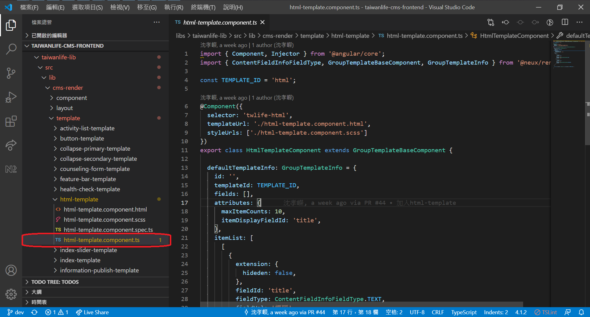
   - #### 元件隸屬資料夾結構
     * 位於 libs/taiwanlife-lib/src/cms-render/template
   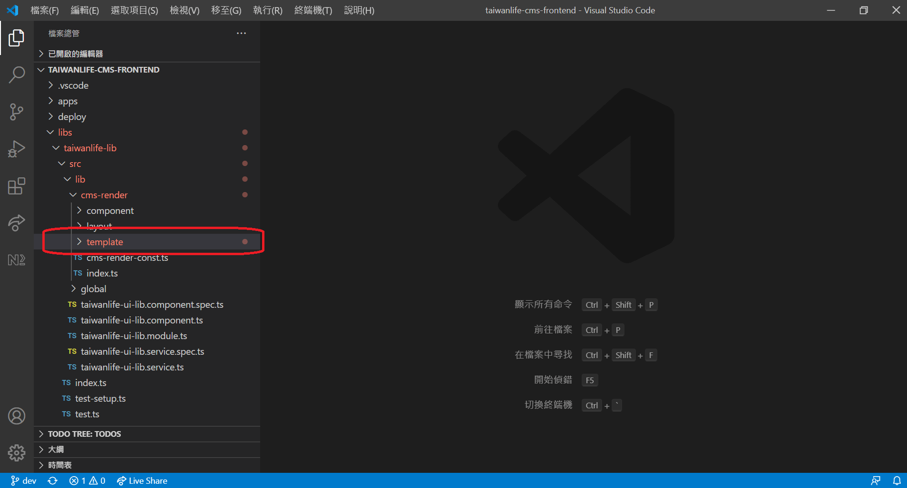
   - #### 使用ng-cli建立元件
      * project 位於 taiwanlife-lib 
        
   - #### 元件匯出
     * 在 libs/taiwanlife-lib/src/lib/cms-render/index.ts 匯出新建立的元件 
      
   - #### 匯入模組
     * 匯入libs/taiwanlife-lib/src/lib/cms-render/taiwanlife-ui-lib.module.ts
     * 於CMS_RENDER_COMPONENTS 加入建立元件
       
   - #### 繼承基底版型
     * 通常分類為套版的版型繼承於 客製化基底版型元件(CustomizeTemplateBaseComponent)
      <div style="width: 50vw ; overflow-x:auto">
     <pre>
     <!-- ```typescript -->
     
      const TEMPLATE_ID = 'sample'; // 對應版型元件的版型 id 
      @Component({
        selector: 'twlife-sample-template',
        templateUrl: './sample-template.component.html',
        styleUrls: ['./sample-template.component.scss']
      })
      export class SampleTemplateComponent extends CustomizeTemplateBaseComponent  {
          defaultTemplateInfo: ContentTemplateInfoModel = { 
             id: '',
             templateId: TEMPLATE_ID,
             fields: [],
             attributes: {}
          };
           constructor(injector: Injector) {
             super(injector, TEMPLATE_ID); 
           }
         }
        
     <!-- ``` -->
     </pre>
     </div>
     
     * TEMPLATE_ID[^5]
     * defaultTemplateInfo[^6]
     * injector[^7]
     * super[^8]
    - #### 加入至component-mapping
      *  在 libs/taiwanlife-lib/src/lib/global/const/component-mapping.ts[^9] 加入建立的版型元件
         
        ```typescript
         {
          component_id: 'sample', 
          component: SampleTemplateComponent,
         }
        ```
        
      
  - ### 建立函式
      - #### 函式名稱規範
        * 命名規則以小駝峰為準則
        * 範例 : cardNewsData
        * 函式參數及回傳結果務必加上型別
        * 範例 :
          
          ```typescript
           private transform(param:number):string{
                return param.toString()||'';
           }
          ```
          
        * 函式務必加上註解(使用Document This[^10] extension)   
             
    - ### 加入至測試節點網頁
       * 步驟一: ng serve taiwanlife-cms 
       * 步驟二: ng serve taiwanlife-render
       * 步驟三: 於 garden 系統 新增測試的節點 
           * 參閱[系統使用說明文件](./instruction#節點新增)
       * 步驟四: 呼叫 API，將剛建立版型元件的templateId 加入至節點內容裡
          * a.複製節點內容
            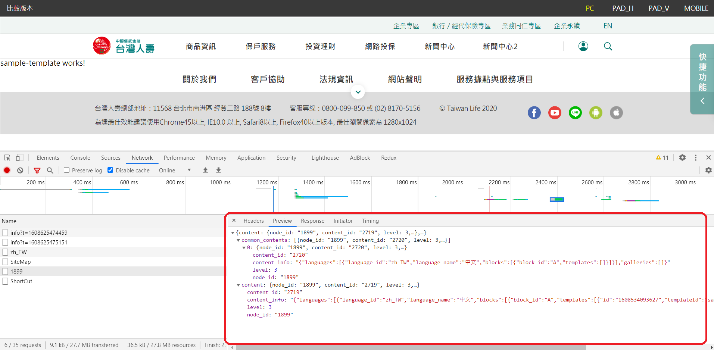
          * b.呼叫 https://dev.walkflow.biz/cms-api/Content/${content_id}，並在templates新增一個template的物件
            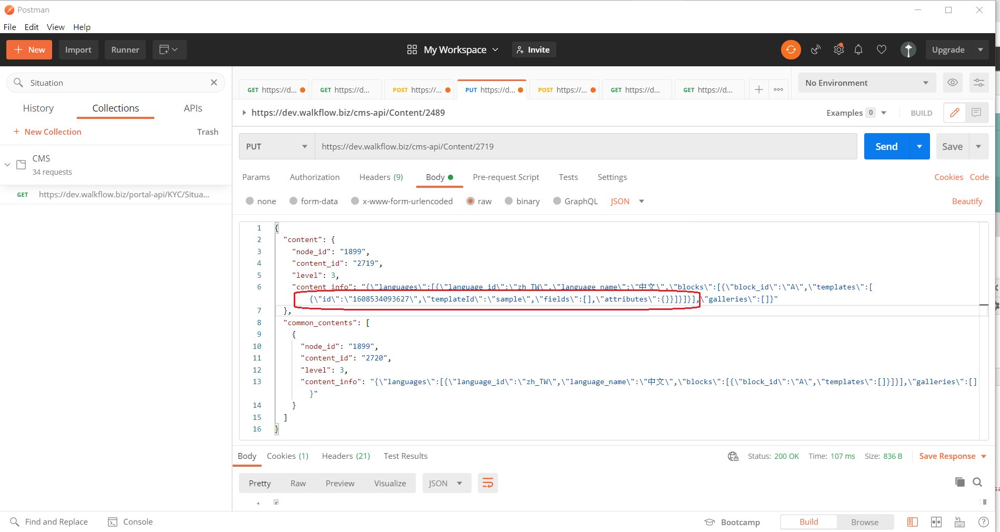 
       * 步驟五: 在本機 serve起來的 render app 查看建立的版型元件
            


## 新增API 
 - ### 建立服務
    - #### 服務名稱規範 
      * service 名稱務必與stoplight上API分類名稱相同
          * 例如 kyc.service.ts
    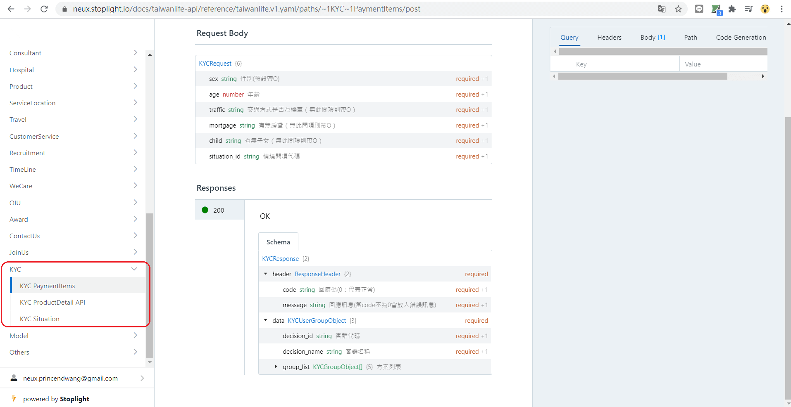
      <br>
      <br> 
    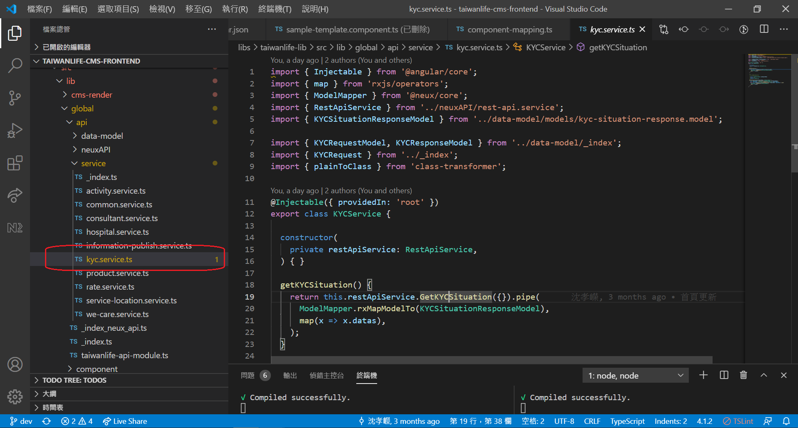
    - #### 服務隸屬資料夾結構
      * 位於 libs/taiwanlife-lib/global/api/service
    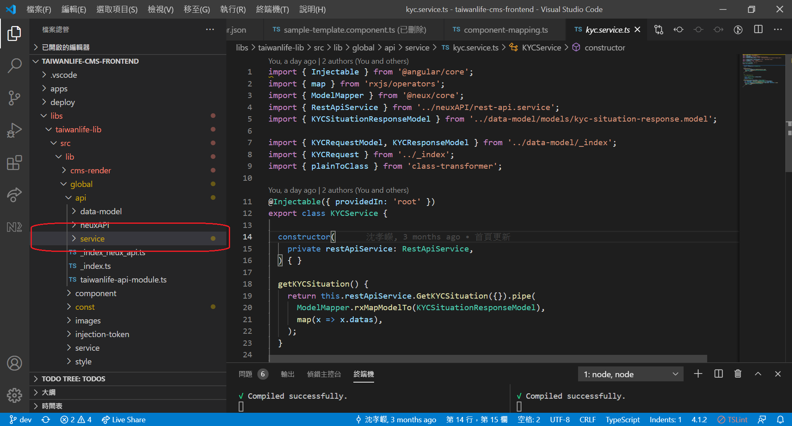
    - #### 使用ng-cli建立服務
       * project 位於 taiwanlife-lib
          
    - #### 服務匯出
      * 在 libs/taiwanlife-lib/src/lib/global/api/service/_index.ts 匯出新建立的服務 
       
    - #### 建立方法 
      * 在呼叫api時 務必使用 restApiService [^11]  
      * 範例 :
       <div style="width: 50vw;overflow-x:auto">
      <pre>
       <!-- ```typescript -->
       getKYCSituation() {
          return this.restApiService.GetKYCSituation({}).pipe(
          ModelMapper.rxMapModelTo(KYCSituationResponseModel),
           map(x => x.datas),
        );
      }
       <!-- ``` -->
      </pre>
       </div>
       
      * ModelMapper[^12]
  - ### 資料格式 
    * 資料格式的轉型，通常後端命名的規則使用snake case，須轉換為 camel case
    - #### model名稱規範 
       * 在Model檔案名稱後方務必加入model後綴 
       * 例如 activity-object.model.ts
         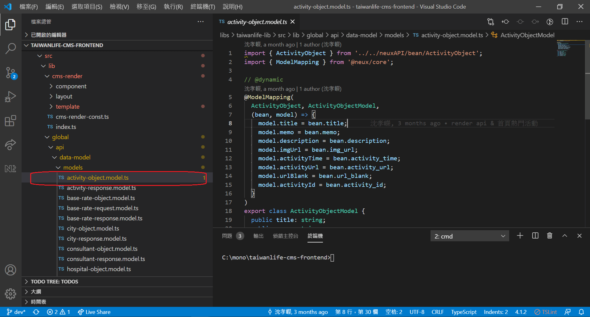 
       * class的命名規則以大駝峰為準則
       * class名稱務必加入Model後綴  
    - #### model隸屬資料夾結構
      * 位於 libs/taiwanlife-lib/src/cms-render/global/api/data-model/models
      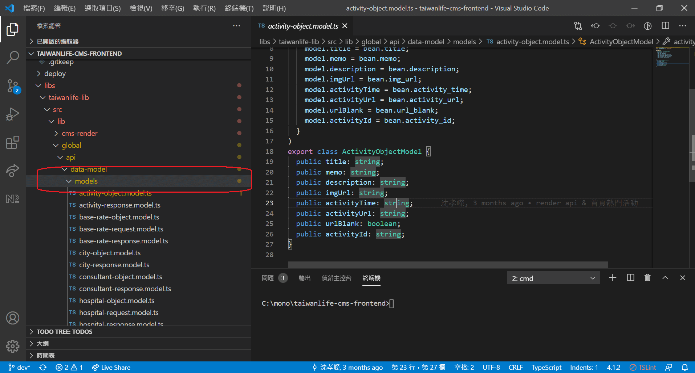
    - #### model建立
      * 範例
      <div style="width: 50vw;overflow-x:auto"> 
      <pre>
      <!-- ```typescript -->
        @ModelMapping(
        ExampleObject,ExampleObjectModel,
        (bean, model) => {
            model.titleUrl = bean.title_url;
        }
        )
        export class ExampleObjectModel {
          public titleUrl: string;
       }
      <!-- ``` -->
      </pre>
      </div>
    - #### model匯出
       * 在libs/taiwanlife-lib/src/lib/global/api/data-model/_index.ts 匯出新建立的Model 
       
    - #### modelMapper使用情境
      - ##### ModelMapper function  
        * mapArrayTo : 當Model裡有陣列型態的屬性時，需使用此function轉型
        * 範例 : 
          
          <div style="width: 50vw;overflow-x:auto">
          <pre>
          <!-- ```typescript -->
            // @dynamic
          @ModelMapping(CityResponse, CityResponseModel,
           (bean, model) => {
           model.header = bean.header;
           model.datas = ModelMapper.mapArrayTo(CityObjectModel, bean.datas);
          }
          )
          export class CityResponseModel {
           public header: ResponseHeader;
           public datas: Array<CityObjectModel>;
          }
          <!-- ``` -->
           </pre>
          </div> 
        * mapModelTo : 當Model裡有物件型態的屬性時，需使用此function轉型
        * 範例 :
          
          <div style="width: 50vw;overflow-x:auto">
          <pre>
          <!-- ```typescript -->
          // @dynamic
          @ModelMapping(
            KYCResponse, KYCResponseModel,
            (bean, model) => {
              model.header = bean.header;
              model.data = ModelMapper.mapModelTo(KYCUserGroupObjectModel, bean.data);
            }
          )
          export class KYCResponseModel {
            public header: ResponseHeader;
            @ValidateNested()
            public data: KYCUserGroupObjectModel;
          }
          <!-- ``` -->
          </pre>
          </div> 
        * rxMapModelTo : 呼叫 API 處理Observable 時，需使用此function轉型
        * 範例 : 

        <div style="width: 50vw;overflow-x:auto">  
        <pre>
        <!-- ```typescript -->
          getDataStatus() {
            return this.restApiService.GetDataStatusKYC({}).pipe(
            ModelMapper.rxMapModelTo(DataStatusResponseModel)
            );
          }
        <!-- ``` -->
        </pre>
        </div>
        
      - ##### 注意事項
          * 盡量避免於套版元件裡使用ModelMapper轉型
    - ### mock資料來源
        * 步驟一 :於 libs/taiwanlife-lib/src/lib/global/api/neuxAPI/res-api.service.ts 找出該API相對應的mock json路徑
        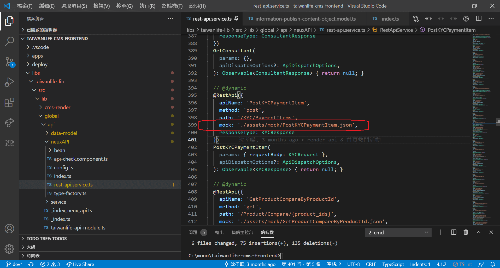
        * 步驟二 : 於 apps/taiwanlife-render/src/assets/mock 資料夾建立相對應的json檔案名稱
         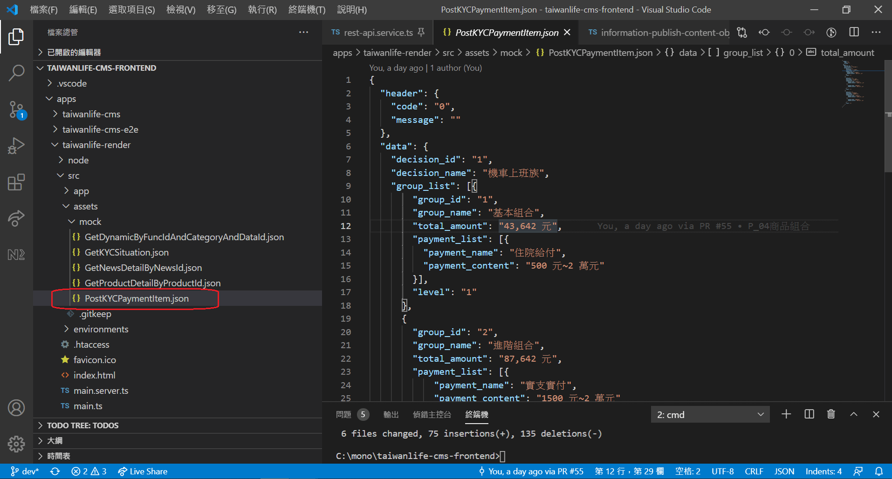 
        * 步驟三 : 於 libs/taiwanlife-lib/src/lib/global/api/neuxAPI/config.ts 更改該API的type為Mock
         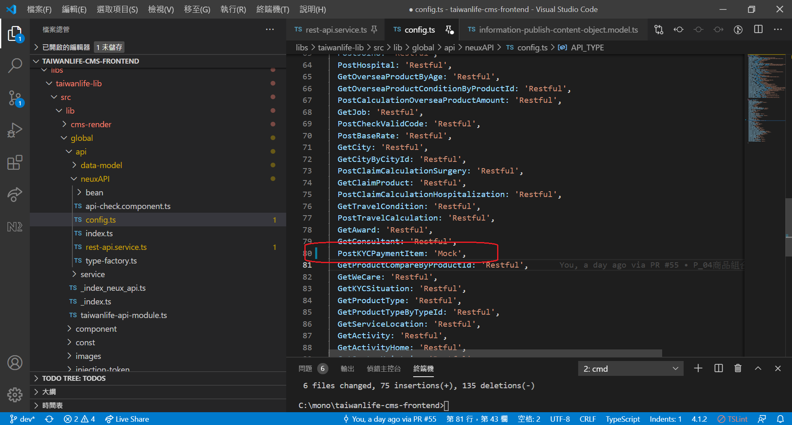   
    - ### 建立token
       - #### token名稱規範
         * token 名稱以大寫加上下劃線組成
         * 名稱後方務必加上TOKEN後綴
         * 範例 : CSSO_ACTION_URL_TOKEN     
       - #### token隸屬資料夾結構 
          * 位於 libs/taiwanlife-lib/src/global/injection-token/taiwanlife-inject-token.ts
          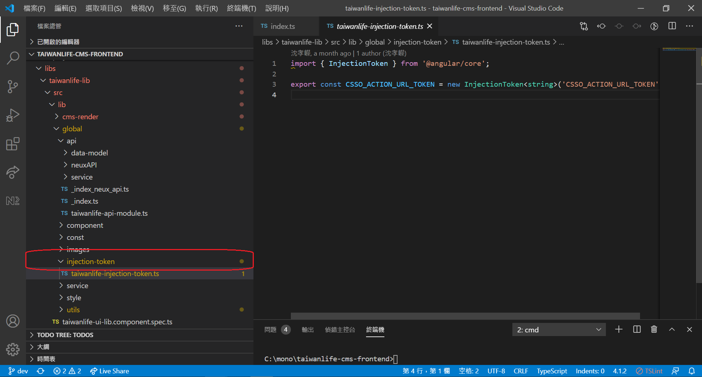
          * 於 taiwanlife-injection-token 新增 token
            
 
## 串接版型 
  - ### 套用切版版型 
    - #### 串接注意事項 
       * 套版版型由切版人員的切版元件所組成，套版元件主要負責處理API資料串接與業務邏輯，切版元件則負責處理樣式及畫面顯示等等
       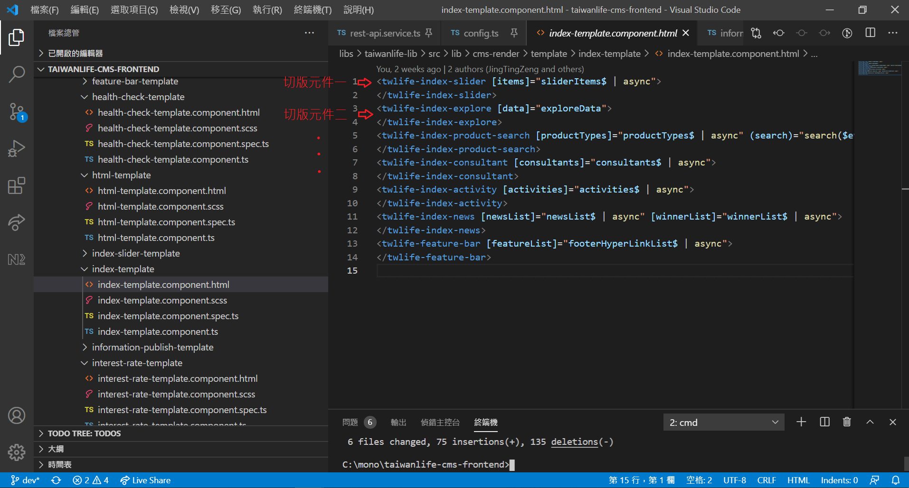 
       * 若是因為後端資料格式大相逕庭，需要調整切版元件的input 與 output，務必檢查taiwanlife-ui 版型統整頁[^13]
         


## util 
  - ### 建立util
    - #### util規範 
       * 若是跨元件需要應用的函式，可以獨立出Util供各元件引入使用。
       * 若是只應用於客戶專案上的Util請將檔案放至所屬專案，若是泛用性很廣的函數請將其放至CMS專案。
    - #### util隸屬資料夾結構 
       * 位於 libs/taiwanlife-lib/src/global/utils
          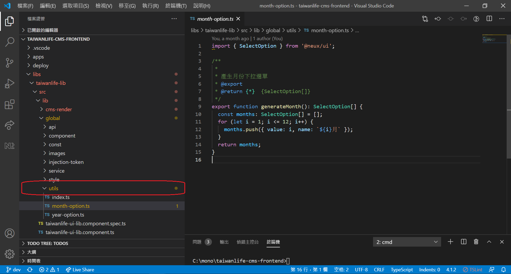  
    - #### util匯出
       * 在libs/taiwanlife-lib/src/lib/global/utils/index.ts 匯出新建立的Util 
        


## 附錄
無


[回Neux CMS 4.0 Documentation](./index)
## 名詞說明
[^1]: 《版型》定義實際畫面的樣子, 每個頁面可由一個到多個版型組成。
[^2]: 《納版》根據設計稿, 將網頁元件設計成多個網頁可以被拉入元件的版型，繼承於TemplateBaseComponent，在編輯模式下可以加入之版型。
[^3]: 《套版》根據設計稿, 將網頁元件設計成該網頁的模板版型， 並繼承於TemplateBaseComponent，在編輯模式下不可加入之版型。
[^4]: 《節點》管理頁面以及權限控管的基本單位, 具有階層性。
[^5]: 《templateId》渲染器渲染時會依據版型的ID找到相對應的版型渲染於畫面上。
[^6]: 《defaultTemplateInfo》預設版型的資訊。
[^7]: 《injector》透過injector.get()方法 可以幫助基底版型元件動態取得token的實體。
[^8]: 所有繼承的子元件，務必要實作自己的 constructor()，否則 aot 編譯時會有以下錯誤 : This constructor is not compatible with Angular Dependency Injection ; contructor 內 super() 時務必傳有值的 templateId。
[^9]: 《COMPONENT_MAPPINGS》 渲染器渲染畫面時需要的Mapping清單。
[^10]: 《Document This》Visual Studio 的 擴充套件，用來說明程式碼用途。
[^11]:《RestApiService》由 neux-core 根據後端的資料規格產生的service檔案。
[^12]:《ModelMapper》neux-core 功能，提供物件轉型，陣列轉型，還有Observable裡物件的轉型等等。
[^13]:《統整頁》將所有切好的版型整合於一個頁面，供開發人員及測試人員查閱

---

